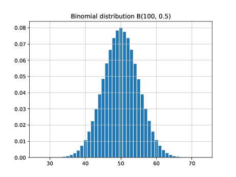

# Using a `Counter` in a parallel computation

This directory contains an example of using a `Counter` in
a parallel computation. In this example we generate
one million binomial random values according to the
binomial distribution `B(100,0.5)`. We divide up the work
using multiple processors. We ask each processor to generate
1000 values and tally the results. This is repeated 1000 times
and the counters are added up to give the final result.

**Note**: This example requires the Julia modules `Distibutions`
and `PyPlot`.

## Structure

This example consists of two files: `parallel-binomial.jl` and
`main.jl`.

In the file `parallel-binomial.jl` we find these functions:
* `binom_rv(n,p)` which generates a single binomial random value with the
given parameters.
* `binomial_counts(n,p,reps)` which (in serial) generates `reps` binomial
random values with parameters `n` and `p`. It returns its result in a
`Counter`.
* `parallel_binomial_counts(n,p,reps,rounds)` makes `rounds` calls to
`binomial_counts(n,p,reps)` and adds the results together. Each call
goes to its own worker.

The file `main.jl` is used to get the computation going and then to
display the result in a histogram.

## Usage

The example is run like this:
```
julia -p 4 main.jl
```
The number `4` may be changed; it gives the number of workers for the
computation.

At the end, the result is displayed in a histogram saved in a
file named `binomial.pdf`. The result looks like this:


