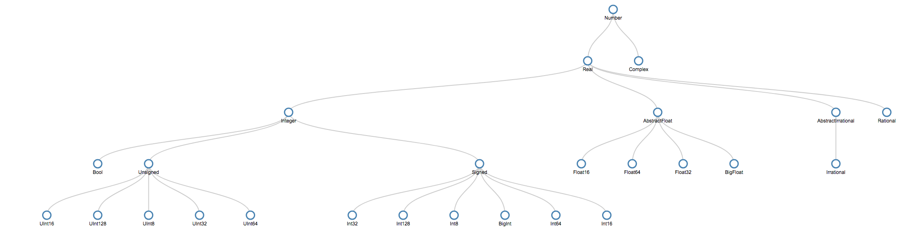

# D3TypeTrees.jl

[](https://travis-ci.org/claytonpbarrows/D3TypeTrees.jl)

[](https://ci.appveyor.com/project/claytonpbarrows/d3typetrees-jl)


julia type hierarchy visualization

## Installation

```
using Pkg
Pkg.add("D3TypeTrees")
```

## Examples

The following will open a D3 visualization of the subtypes of the 'Number' type in your browser (default = 'google chrome').

```julia
DisplayTypeTree(Number)
```



You can also display a tree in the REPL

```julia
julia> TypeTree(Number)
Number
├──Real
│  ├──Integer
│  │  ├──Bool (0 children)
│  │  ├──Unsigned (5 children)
│  │  └──Signed (6 children)
│  ├──AbstractFloat
│  │  ├──Float16 (0 children)
│  │  ├──Float64 (0 children)
│  │  ├──Float32 (0 children)
│  │  └──BigFloat (0 children)
│  ├──AbstractIrrational
│  │  └──Irrational (0 children)
│  └──Rational
└──Complex
```

In a Notebook, the `TypeTree()` displays the D3 tree visualization 


## Limitations

[Requires an internet connection](https://github.com/sisl/D3Trees.jl/blob/master/README.md#limitations)