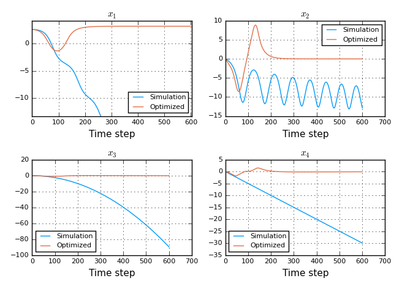
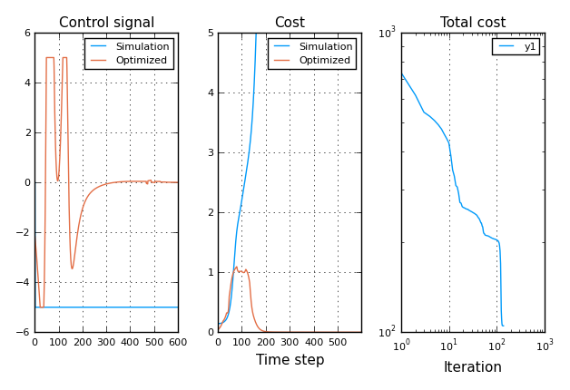

# DifferentialDynamicProgramming

[](https://travis-ci.org/baggepinnen/DifferentialDynamicProgramming.jl)

[](https://coveralls.io/github/baggepinnen/DifferentialDynamicProgramming.jl?branch=master)

## Installation
The package is registered and can be added with  
`] add DifferentialDynamicProgramming`  
The latest version is formally compatible with Julia v1.1+ (but probably works well for julia v1.0 as well if you `dev` it).

## Demo functions
The following demo functions are provided


`demo_linear()`     To run the iLQG DDP algorithm on a simple linear problem  
`demoQP`            To solve a demo quadratic program  
`demo_pendcart()`   Where a pendulum attached to a cart is simulated.


## Usage
### Demo linear
See demo file `demo_linear.jl` for a usage example.

```julia
# make stable linear dynamics
h = .01         # time step
n = 10          # state dimension
m = 2           # control dimension
A = randn(n,n)
A = A-A'        # skew-symmetric = pure imaginary eigenvalues
A = exp(h*A)    # discrete time
B = h*randn(n,m)

# quadratic costs
Q    = h*eye(n)
R    = .1*h*eye(m)

# control limits
lims = [] #ones(m,1)*[-1 1]*.6

T    = 1000             # horizon
x0   = ones(n,1)        # initial state
u0   = .1*randn(m,T)    # initial controls

# optimization problem
N    = T+1
fx   = A
fu   = B
cxx  = Q
cxu  = zeros(size(B))
cuu  = R

# Specify dynamics functions
function lin_dyn_df(x,u,Q,R)
    u[isnan(u)] = 0
    cx  = Q*x
    cu  = R*u
    fxx=fxu=fuu = []
    return fx,fu,fxx,fxu,fuu,cx,cu,cxx,cxu,cuu
end
function lin_dyn_f(x,u,A,B)
    u[isnan(u)] = 0
    xnew = A*x + B*u
    return xnew
end

function lin_dyn_cost(x,u,Q)
    c = 0.5*sum(x.*(Q*x)) + 0.5*sum(u.*(R*u))
    return c
end

f(x,u,i)     = lin_dyn_f(x,u,A,B,Q,R)
costfun(x,u) = lin_dyn_cost(x,u,Q)
df(x,u)      = lin_dyn_df(x,u,Q,R)

# run the optimization

@time x, u, L, Vx, Vxx, cost, otrace = iLQG(f, costfun ,df, x0, u0, lims=lims);
```


### Demo pendulum on cart
There is an additional demo function `demo_pendcart()`, where a pendulum attached to a cart is simulated. In this example, regular LQG control fails in stabilizing the pendulum at the upright position due to control limitations. The DDP-based optimization solves this by letting the pendulum fall, and increases the energy in the pendulum during the fall such that it will stay upright after one revolution.





# Citing
This code consists of a port and extensions of a MATLAB library provided by the autors of
```
BIBTeX:
@INPROCEEDINGS{
  author    = {Tassa, Y. and Mansard, N. and Todorov, E.},
  booktitle = {Robotics and Automation (ICRA), 2014 IEEE International Conference on},
  title     = {Control-Limited Differential Dynamic Programming},
  year      = {2014}, month={May}, doi={10.1109/ICRA.2014.6907001}}
  http://www.mathworks.com/matlabcentral/fileexchange/52069-ilqg-ddp-trajectory-optimization
  http://www.cs.washington.edu/people/postdocs/tassa/
```

The code above was extended with KL-divergence constrained optimization for the thesis
[Bagge Carlson, F.](https://www.control.lth.se/staff/fredrik-bagge-carlson/), ["Machine Learning and System Identification for Estimation in Physical Systems"](https://lup.lub.lu.se/search/publication/ffb8dc85-ce12-4f75-8f2b-0881e492f6c0) (PhD Thesis 2018).
```bibtex
@thesis{bagge2018,
  title        = {Machine Learning and System Identification for Estimation in Physical Systems},
  author       = {Bagge Carlson, Fredrik},
  keyword      = {Machine Learning,System Identification,Robotics,Spectral estimation,Calibration,State estimation},
  month        = {12},
  type         = {PhD Thesis},
  number       = {TFRT-1122},
  institution  = {Dept. Automatic Control, Lund University, Sweden},
  year         = {2018},
  url          = {https://lup.lub.lu.se/search/publication/ffb8dc85-ce12-4f75-8f2b-0881e492f6c0},
}
```
