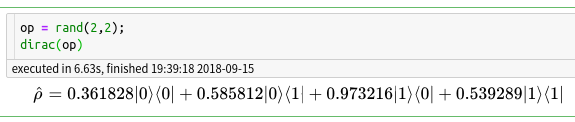

# DiracNotation

[](https://travis-ci.org/goropikari/DiracNotation.jl)
[](https://ci.appveyor.com/project/goropikari/diracnotation-jl)
[](https://coveralls.io/github/goropikari/DiracNotation.jl?branch=master)
[](http://codecov.io/github/goropikari/DiracNotation.jl?branch=master)

By using this package, matrix representation is changed into Dirac notation.
This package supports [QuantumOptics.jl](https://github.com/qojulia/QuantumOptics.jl)



## Installation
```julia
using Pkg
Pkg.pkg"add https://github.com/goropikari/DiracNotation.jl"
```

## Usage
### Simple example
```julia
julia> using DiracNotation, LinearAlgebra, Random; Random.seed!(0);

julia> ket = normalize(rand(4)); bra = ket';

julia> dirac(ket) # if the dimension of state is a power of 2 ( 2^n ), it is interpreted as n-qubit system.
|ψ⟩ = 0.65825|00⟩+0.727547|01⟩+0.131519|10⟩+0.141719|11⟩

julia> dirac(bra)
⟨ψ| = 0.65825⟨00|+0.727547⟨01|+0.131519⟨10|+0.141719⟨11|

julia> DiracNotation.set_properties(precision=3)

julia> op = rand(2,2);

julia> leftdims = [2];

julia> rightdims = [2];

julia> dirac(op, leftdims, rightdims)
ρ = 0.279|0⟩⟨0|+0.0423|0⟩⟨1|+0.203|1⟩⟨0|+0.0683|1⟩⟨1|

julia> DiracNotation.set_properties(numhead=10, displayall=false) # display numhead terms

julia> op = rand(6,4);

# if the system is not a qubits system, you have to specify the dimensions explicitly.
julia> dirac(op, [2,3], [2,2])
ρ = 0.362|00⟩⟨00|+0.167|00⟩⟨01|+0.469|00⟩⟨10|+0.0668|00⟩⟨11|+0.973|01⟩⟨00|+0.655|01⟩⟨01|+0.0624|01⟩⟨10|+0.157|01⟩⟨11|+0.586|02⟩⟨00|+0.576|02⟩⟨01| +...
```


### Display a state with arbitrary state name.
```julia
julia> dirac(ket, "ϕ")
|ϕ⟩ = 0.658|00⟩+0.728|01⟩+0.132|10⟩+0.142|11⟩

julia> dirac(op, [2,3], [2,2], "A")
A = 0.362|00⟩⟨00|+0.167|00⟩⟨01|+0.469|00⟩⟨10|+0.0668|00⟩⟨11|+0.973|01⟩⟨00|+0.655|01⟩⟨01|+0.0624|01⟩⟨10|+0.157|01⟩⟨11|+0.586|02⟩⟨00|+0.576|02⟩⟨01| +...
```

### Restore to original style
```julia
julia> DiracNotation.reset_properties()

julia> dirac(ket, "ϕ")
|ϕ⟩ = 0.65825|00⟩+0.727547|01⟩+0.131519|10⟩+0.141719|11⟩

julia> dirac(op, [2,3], [2,2], "A")
A = 0.361828|00⟩⟨00|+0.167036|00⟩⟨01|+0.469304|00⟩⟨10|+0.0668464|00⟩⟨11|+0.973216|01⟩⟨00|+0.655448|01⟩⟨01|+0.0623676|01⟩⟨10|+0.156637|01⟩⟨11|+0.585812|02⟩⟨00|+0.575887|02⟩⟨01|+0.353129|02⟩⟨10|+0.605297|02⟩⟨11|+0.539289|10⟩⟨00|+0.868279|10⟩⟨01|+0.767602|10⟩⟨10|+0.135745|10⟩⟨11|+0.260036|11⟩⟨00|+0.9678|11⟩⟨01|+0.043141|11⟩⟨10|+0.838118|11⟩⟨11|+0.910047|12⟩⟨00|+0.76769|12⟩⟨01|+0.267985|12⟩⟨10|+0.914712|12⟩⟨11|
```


## Example on IJulia
On IJulia, Dirac notation is rendered as MathJax.

- [Example](http://nbviewer.jupyter.org/github/goropikari/DiracNotation.jl/blob/master/examples/example.ipynb)
