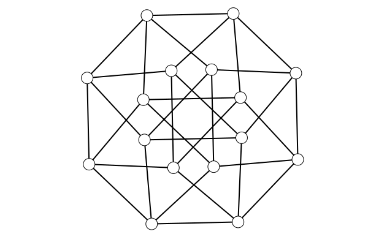
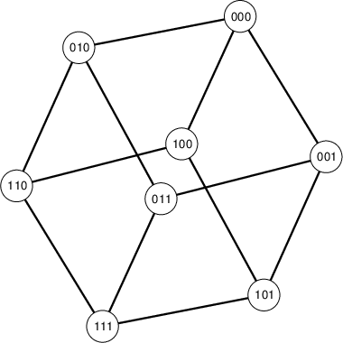
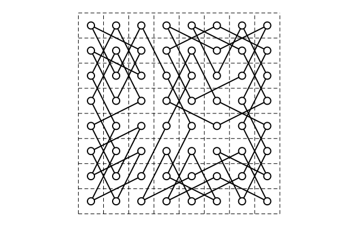

# DrawSimpleGraphs
Drawing functions for `SimpleGraphs`.


[](https://travis-ci.org/scheinerman/DrawSimpleGraphs.jl)

[](http://codecov.io/github/scheinerman/DrawSimpleGraphs.jl?branch=master)


Given a `SimpleGraph`, the function `draw(G)` draws `G` in its current embedding.
If the graph does not have an embedding, then it is given a circular embedding.

If further operations on the drawing are desired,
then `Plots` or `SimpleDrawing` functions may be used.

```julia
julia> using SimpleGraphs, DrawSimpleGraphs, Plots

julia> G = Cube(4)
Cube graph Q(4) (n=16, m=32)

julia> embed(G,:combined)

julia> draw(G)

julia> savefig("four-cube.png")
```


## Embedding Commands

The following functions reside in `SimpleGraphs`. They are used to
create and manipulate embeddings associated with a graph.

### Create an embedding

`embed(G,method)` creates a new embedding of `G`. The second
argument method is a symbol associated with an embedding algorithm.
The `method` can be one of the following:
* `:circular` (default) arranges the vertices in a circle.
* `:random` arranges the vertices at random.
* `:spring` arranges the vertices by modeling edges as springs holding repelling vertices together.
* `:stress` arranges the vertices by attempting to put vertices geometric distance equal to their graph-theoretic distance.
* `:combined` is equivalent to first performing a `spring` embedding followed by a `stress` embedding. Often gives nice results.
* `:spectral` arranges the vertices based on the eigenvectors of the Laplacian matrix of the graph. Specifically, the `x`-coordinates come from the eigenvector
associated with the second smallest eigenvalue, and the
`y`-coordinates come from the eigenvector associated with the third
smallest.

In addition, `embed(G,xy)` will give the graph an embedding
specified in the dictionary `xy` where maps vertices to two-element
vectors.

### Modify an embedding

* `has_embedding(G)` checks to see if the graph has been provided with an embedding.
* `getxy(G)` retrieves a copy of the embedding. Modifying the output of `getxy` does *not* modify the embedding of the graph.

* `set_line_color(G,name)` assigns the color in the string `name` to the edges and boundaries of the vertices. Defaults to `"black"`.
* `get_line_color(G)` returns the line color.
* `set_fill_color(G,name)` assigns the color in the string `name` to be the fill color of the vertices. Defaults to `"white"`.
* `set_vertex_size(G,sz)` sets the size of the drawn vertices to
the integer `sz`.
* `get_vertex_size(G)` returns the size of the vertices.

* `transform(G,A,b)` applies an affine transformation to all coordinates in the graph's drawing. Here `A` is 2-by-2 matrix and `b` is a 2-vector. Each point `p` is mapped to `A*p+b`. Special
versions of this command are provided by `scale`, `rotate`, `translate`, and `recenter`. (Note: Some of these function names cause collisions, so I may change them.)

* `edge_length(G,uv)` returns the geometric length of the edge `uv`. Note this fails if `G` does not have an embedding.
`edge_length(G)` returns an array of the edge lengths.

## Vertex Labels

Use `draw_labels(G)` after `draw(G)` to insert vertex names into the drawing.
Optionally, add a font size, `draw_labels(G,sz)`, to make the labels small
enough to fit (or use `set_vertex_size` to make larger vertices).

```julia
julia> G = Cube(3)
Cube graph Q(3) (n=8, m=12)

julia> embed(G,:combined)

julia> set_vertex_size(G,20)

julia> draw(G)

julia> draw_labels(G)
```





## Example: Knight's Tour

The function `KnightTourDrawing(r,c)` to solve the problem
of finding a knight's tour on an `r`-by-`c` chess board and
drawing the solution.
```julia
julia> KnightTourDrawing(8,8)
Searching for a Hamiltonian cycle in an 8-by-8 Knight's move graph
1374.144891 seconds (9.02 G allocations: 1002.489 GiB, 12.68% gc time)
Finished
```

