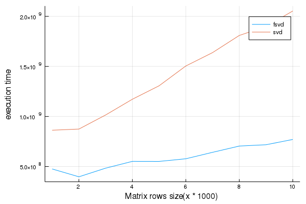

# FameSVD 
[](https://travis-ci.com/MxAR/FameSVD.jl)
## Introduction 
This package provides an implementation of the FameSVD algorithm via the BLAS and LAPACK routines `syrk`, `syevr` and `gemm`, The provided method is faster than the SVD algorithm used in the Julia standard library and as shown in the paper faster than the Krylov-Method and Randomized-PCA.



Please note that column size was kept contstant at 1000 and the machine used had 16GB DDR4 RAM and an Intel i7-8565U CPU running at 4.6GHz.

## Usage
The package provides the function `fsvd` which returns an `LinearAlgebra.SVD` object.
```julia
S = FameSVD.fsvd(A)
```

## References
Xiaocan Li, Shuo Wang and Yinghao Cai: "FameSVD: Fast and Memory-efficient Singular Value Decomposition"; [arXiv:1906.12085v1](https://arxiv.org/abs/1906.12085)
