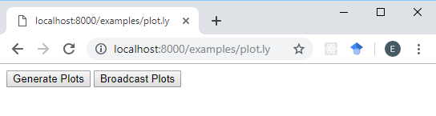
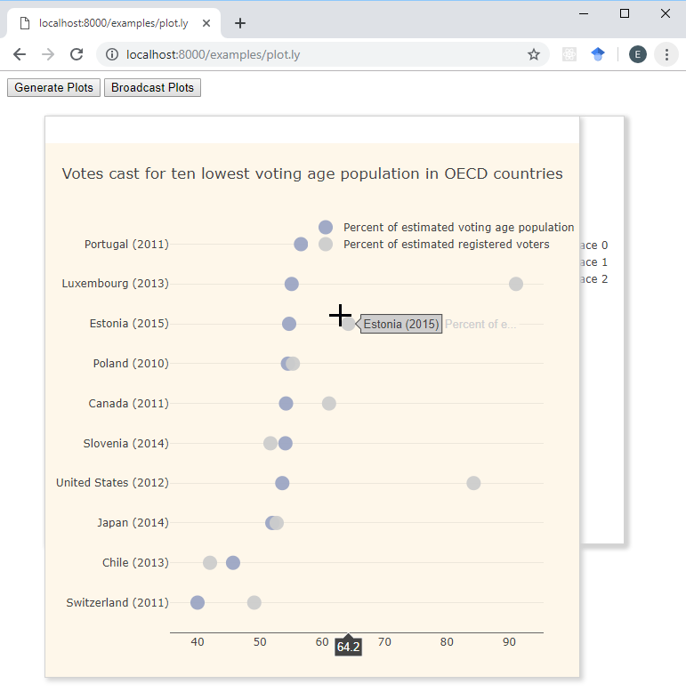
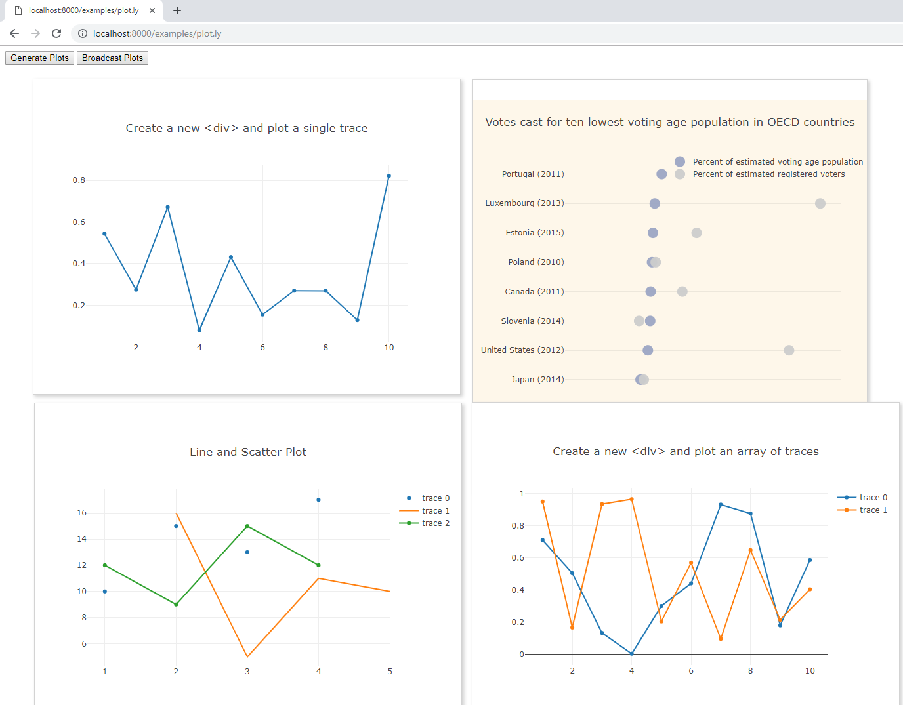
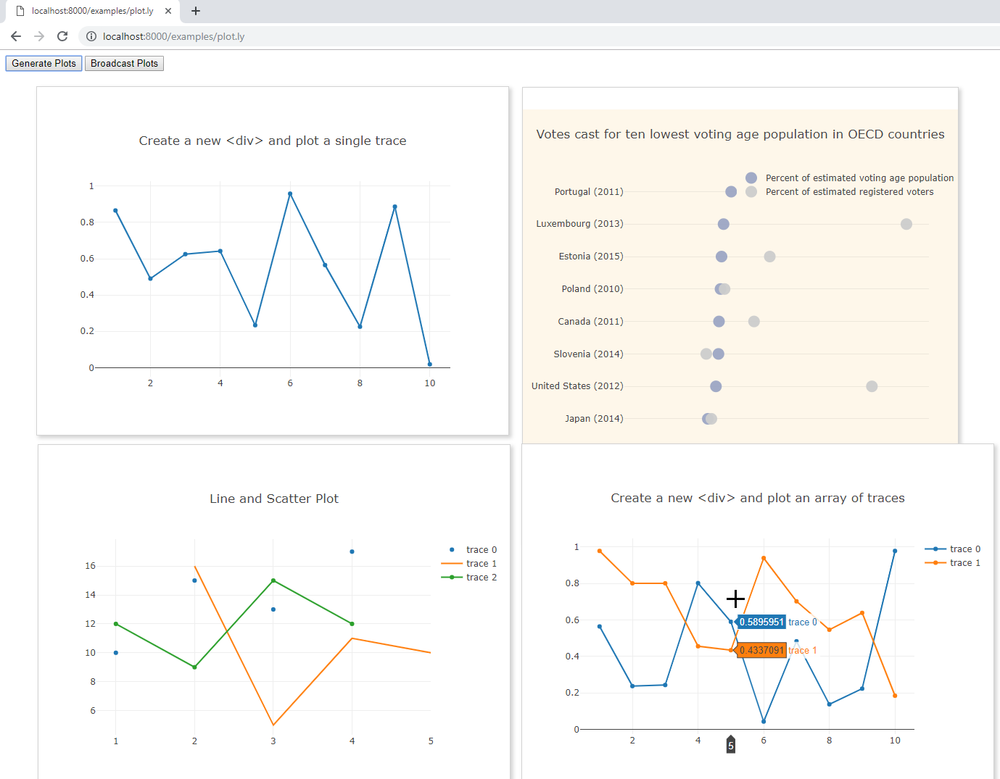

# Figures.jl

[![][travis-img]][travis-url] [![][appveyor-img]][appveyor-url]

`Figures.jl` is a simple package that creates draggable figures in a browser window to display plots from various plotting packages. It currently works with `plotly.js`.

`Figures.jl` is still in early stages of development, will likely see API changes and is not (yet) intended for use in a production environment.

To obtain the latest tagged release, try:

```julia
pkg> add Figures
```

To obtain the latest development branch, try:

```julia
pkg> add Figures#master
```

## Example

The simplest way to see an example is to run

```julia
julia> using Figures; Figures.examples(launch=true);
```

This

1. Starts a server on localhost at the default port 8000.
2. Opens a new browser tab to <http://localhost:8000/examples/plot.ly.>

If you prefer a different port and do not want to launch a new browser tab (which is better for interactive work, i.e. it is what I do), try

```julia
julia> using Figures; Figures.example(port=3000)
```

or simply

```julia
julia> using Figures; Figures.example() # Uses the default port 8000.
```

This starts the local server, but then you need to manually open - or refresh - the url from the browser at <http://localhost:8000/examples/plot.ly>.

You should see a blank page with two buttons as shown below:



Clicking "Generate Plots", you should see (after a brief warmup the first time) 4 interactive `plotly.js` charts overlaid on top of each other.



Each chart has a thin strip at the top (seen in white). This strip serves two purposes:

1. Click and drag the strip to move the figure.
1. Double click the strip to close the figure.



Clicking "Generate Plots" again, will update two of the four charts with random data.



The usual `plotly.js` interactivity is also available:


Next, you can open a second browser tab to the same url <http://localhost:8000/examples/plot.ly>. It is best if the two pages are open side by side.

Clicking "Generate Plots" will only update the charts in the given window where the button was clicked. "Broadcast Plots" will update the charts on all connected pages.

To remove figures, there is the method

```julia
julia> Figures.closeall()
```

which closes all figures and

```julia
julia> Figures.close("Plot4")
```

which closes the specified figure.

Alternatively, figures can be closed directly in the browser by double clicking them.

### To Do

* Add support for `VegaLite.jl`
* Add support for `Plots.jl`
* Add support for resizing figures, etc.

[travis-img]: https://travis-ci.org/EricForgy/Figures.jl.svg?branch=master
[travis-url]: https://travis-ci.org/EricForgy/Figures.jl

[appveyor-img]: https://ci.appveyor.com/api/projects/status/github/EricForgy/Figures.jl?branch=master&svg=true
[appveyor-url]: https://ci.appveyor.com/project/EricForgy/figures-jl
