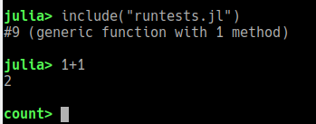
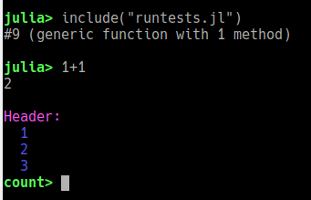
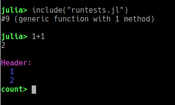
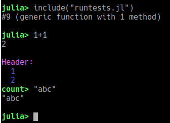

# HeaderREPLs

[](https://travis-ci.org/timholy/HeaderREPLs.jl)
[](https://ci.appveyor.com/project/timholy/revise-jl/branch/master)
[](http://codecov.io/github/timholy/HeaderREPLs.jl?branch=master)

`HeaderREPLs.jl` is a Julia package that allows you to extend Julia's amazing REPL
to support "mini-applications" that need to communicate more information to the user.
They allow you to define a custom "header" type that you can use to print extra
information above the prompt.

To demonstrate, here we build a `CountingHeader` type and show how the header is printed:

```julia
mutable struct CountingHeader <: AbstractHeader    # note must be mutable and contain nlines field
    n::Int            # internal data needed by the header
    nlines::Int       # the number of lines needed for display---update this in print_header
end

function HeaderREPLs.print_header(io::IO, header::CountingHeader)
    if header.nlines == 0
        if header.n > 0
            printstyled(io, "Header:\n"; color=:light_magenta)
            for i = 1:header.n
                printstyled(io, "  ", i, '\n'; color=:light_blue)
            end
        end
        header.nlines = nlines(header.n)
    end
    return nothing
end
```

In `test/runtests.jl` there is a complete example showing how you initialize this
mode and specify the user interaction: briefly, a pipe character ('|') switches into
"count" mode, and once in "count" mode '+' and '-' increment and decrement `n`.

Here, let's check out the outcome with a series of images.



This is what you see when you first press '|'.
`n` starts at 0, and our `print_header` method above displays nothing in that case.



This is what you get after pressing '+' three times.



Now after pressing '-'. Note the line moved up to stay aligned.



Note we can enter Julia commands as usual.
In this demo, "count" mode is non-sticky, so it reverts back to the `julia>` prompt.

In theory at least, "count" mode works as you'd expect when you traverse the
history: when you get to a "count" line it shows the (current) header.

## Utilities

The package exports a few utilities that may make it easier to define custom REPL modes.
Aside from key-binding initialization utilities (see the source for details),
perhaps the two most useful are `find_prompt` and `count_display_lines`.
Use `?` for more information.

## Notes

Currently this package overwrites a few methods in Julia's "REPL" standard library.
This generates some warnings.
Hopefully we can eliminate them in a future version of this package.
