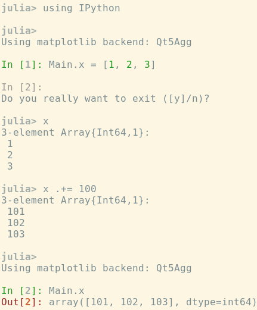

# Launch IPython in Julia

[![Build Status][travis-img]][travis-url]
[![Coverage Status][coveralls-img]][coveralls-url]
[![codecov.io][codecov-img]][codecov-url]





## Usage

Run `using IPython` and then type `.` in empty `julia>` prompt or run
`IPython.start_ipython()`.  If you are using IPython 7.0 or above, you
can switch back to Julia REPL by `backspace` or `ctrl-h` key (like
other REPL modes).  For older versions of IPython, exiting IPython as
usual (e.g., `ctrl-d`) brings you back to the Julia REPL.  Re-entering
IPython keeps the previous state.  Use pre-defined `Main` object to
access Julia namespace from IPython.  Use `py"..."` string macro to
access Python namespace from Julia.

**Note:**
First launch of IPython may be slow.


## Requirements

### Julia

* PyCall

### Python

* IPython (7.0 or above is recommended)


## Accessing Julia from Python

If simple `Main.eval("...")` and `Main.<name>` accessor is not enough,
[PyJulia] is a nice way to access Julia objects from Python.  For
example, you can import any Julia package from Python:

[PyJulia]: https://github.com/JuliaPy/pyjulia

```pycon
>>> from julia import Base
>>> Base.banner()
```

For more advanced/experimental Julia-(I)Python integration, see
[`ipyjulia_hacks`].

[`ipyjulia_hacks`]: http://ipyjulia-hacks.readthedocs.io/en/latest


## Configuration

### Julia-mode like prompt

If you want IPython prompt to look like a part of Julia prompt, then add
the following snippet in `~/.ipython/profile_default/ipython_config.py`:

```python
try:
    from ipython_jl.tools import JuliaModePrompt
except ImportError:
    pass
else:
    c.TerminalInteractiveShell.prompts_class = JuliaModePrompt
```

Then the prompt would then look like `ipy 1>` instead of `In [1]:`.
It also removes `Out[1]`.  Note that above setting does not change
your normal IPython prompts.


[travis-img]: https://travis-ci.org/tkf/IPython.jl.svg?branch=master
[travis-url]: https://travis-ci.org/tkf/IPython.jl
[coveralls-img]: https://coveralls.io/repos/tkf/IPython.jl/badge.svg?branch=master&service=github
[coveralls-url]: https://coveralls.io/github/tkf/IPython.jl?branch=master
[codecov-img]: http://codecov.io/github/tkf/IPython.jl/coverage.svg?branch=master
[codecov-url]: http://codecov.io/github/tkf/IPython.jl?branch=master
