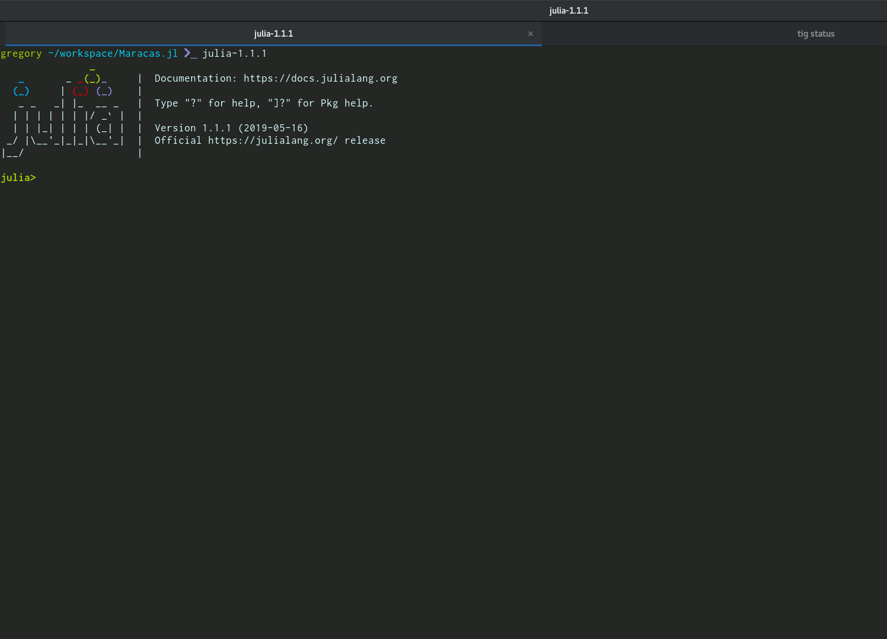

# Maracas
[](https://travis-ci.org/apieum/Maracas.jl)

The **Maracas** package extends julia base/test.jl to provide syntactic sugar and verbose output to tests.

**Launch your tests as usual**



## Features

- document your code with nested typed test sets
- show indented colored results, modifiable by user
- `@describe description::String begin ... end` : group tests under the given description
- `@it description::String begin ... end` : describe a specification
- `@unit description::String begin ... end` : describe a simple unit test
- `@skip` : will mark as skipped any assertion test, or maracas testset, macro placed after it.


## Usage

First, in your test file declare you're using the package:

```julia
using Maracas
```

Then write your testsets with `@describe`, `@it`, or `@unit` functions with the same assertions as usual (`@test`, `@test_throws`)

You can also prefix testset functions with @skip like '@skip @describe', '@skip @it', or '@skip @unit' to skip a testset: the title will be shown in test results but the testset is not executed and all contained tests are ignored.

@skip works also before any macro starting with *"@test"* (`@test`, `@test_throws`, `@test_broken`...)

```julia
using Maracas
is_magenta(ts::MaracasTestSet)=occursin(Base.text_colors[:magenta], ts.description)
is_blue(ts::MaracasTestSet)=occursin(Base.text_colors[:blue], ts.description)
is_cyan(ts::MaracasTestSet)=occursin(Base.text_colors[:cyan], ts.description)

@describe "it is a test suite" begin
    @it "has specs" begin
        a_spec = @it("is made with macro '@it'", begin end)
        @test occursin("[Spec]", a_spec.description)
    end
    @it "has tests" begin
        a_test = @unit("made with macro '@unit'", begin end)
        @test occursin("[Test]", a_test.description)
    end

    @unit "test suite title is magenta by default" begin
        nested_describe = @describe("you can document your code with your tests", begin end)
        @test is_magenta(nested_describe)
    end

    @unit "spec title is cyan by default" begin
        @test is_cyan(@it("is cyan", begin end))
    end
    @unit "test title is blue by default" begin
        @test is_blue(@unit("in blue", begin end))
    end

    @unit "'it' is prepended to specs" begin
        description = "had a spec description not starting with it"
        a_spec = @it("had a spec description not starting with it", begin end)
        @test occursin(string("it ", description), a_spec.description)
    end

    @skip @describe "a whole describe can be skipped" begin
        @it "should not be executed" begin
            @test false
        end
    end
    @skip @it "can skip '@it' with @skip" begin
        @test false
    end
    @skip @unit "'@unit' can be skipped with @skip" begin
        @test false
    end
    @skip @testset "@skip works with default testset but it's not shown in results" begin
        @test false
    end
    @unit "@skip can also skip @test assertions" begin
        @skip @test false
        @skip @test_throws false
        @skip @test_skip false
        @skip @test_broken false
    end
end

```

### Changing Styles

You can modify color and boldness with the folowing functions:

- `set_title_style(color::TextColor, bold::Bool=true)`: change the style of titles defined with `describe` (default: `:magenta`)
- `set_test_style(color::TextColor, bold::Bool=true)`:  change the style of `[test]`  (default: `:blue`)
- `set_spec_style(color::TextColor, bold::Bool=true)`: change the style of `[spec]`  (default: `:cyan`)
- `set_error_color(color::TextColor)`: set the color of error results  (default: `:red`)
- `set_warn_color(color::TextColor)`: set the color of warn results  (default: `:yellow`)
- `set_pass_color(color::TextColor)`: set the color of pass results  (default: `:green`)
- `set_info_color(color::TextColor)`: set the color of total results  (default: `:blue`)

Available colors are defined by `Base.text_colors`, which are either UInt8 between 0 and 255 inclusive or symbols you'll find inside julia REPL Help mode about `Base.text_colors`.


```
$ julia
               _
   _       _ _(_)_     |  A fresh approach to technical computing
  (_)     | (_) (_)    |  Documentation: https://docs.julialang.org
   _ _   _| |_  __ _   |  Type "?help" for help.
  | | | | | | |/ _` |  |
  | | |_| | | | (_| |  |  Version 0.6.0 (2017-06-19 13:05 UTC)
 _/ |\__'_|_|_|\__'_|  |
|__/                   |  x86_64-redhat-linux

help?> Base.text_colors
  Dictionary of color codes for the terminal.

  Available colors are: :normal, :default, :bold, :black, :blue, :cyan, :green, :light_black, :light_blue, :light_cyan, :light_green, :light_magenta, :light_red, :light_yellow, :magenta, :nothing, :red,
  :white, or :yellow as well as the integers 0 to 255 inclusive.

  The color :default will print text in the default color while the color :normal will print text with all text properties (like boldness) reset. Printing with the color :nothing will print the string without
  modifications.

```
