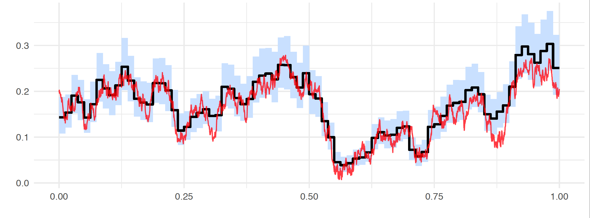

[](https://travis-ci.org/mschauer/MicrostructureNoise.jl)
[](https://coveralls.io/github/mschauer/MicrostructureNoise.jl?branch=master)
[](http://codecov.io/github/mschauer/MicrostructureNoise.jl?branch=master)
[](https://mschauer.github.io/MicrostructureNoise.jl/latest/)
[](https://doi.org/10.5281/zenodo.1241011)


# MicrostructureNoise

## Overview

MicrostructureNoise is a [Julia](https://github.com/JuliaLang/julia) package for Bayesian volatility estimation in presence of market microstructure noise.

## Installation

To install, run:

```
Pkg.add("MicrostructureNoise")
```

## Description

MicrostructureNoise estimates the volatility function <a href="https://www.codecogs.com/eqnedit.php?latex=s" target="_blank"></a> of the stochastic differential equation

<a href="https://www.codecogs.com/eqnedit.php?latex=dX_t&space;=&space;b(t,X_t)&space;dt&space;&plus;&space;s(t)&space;dW_t,&space;\quad&space;X_0&space;=&space;x_0,&space;\quad&space;t&space;\in&space;[0,T]" target="_blank"></a>

from noisy observations of its solution

<a href="https://www.codecogs.com/eqnedit.php?latex=Y_i&space;=&space;X(t_i)&space;&plus;&space;V_i,&space;\quad&space;0&space;<&space;t_1&space;<&space;\ldots&space;<&space;t_n&space;=&space;T," target="_blank"></a>

where <a href="https://www.codecogs.com/eqnedit.php?latex=\{V_i\}" target="_blank"></a> denote unobservable stochastic disturbances. The method is minimalistic in its assumptions on the volatility function, which in particular can itself be a stochastic process.

The estimation methodology is intuitive to understand, given that its ingredients are well-known statistical techniques. The posterior inference is performed via the Gibbs sampler, with the Forward Filtering Backward Simulation algorithm used to reconstruct unobservable states <a href="https://www.codecogs.com/eqnedit.php?latex=X(t_i)" target="_blank"></a>. This relies on the Kalman filter. The unknown squared volatility function is a priori modelled as piecewise constant and is assigned the inverse Gamma Markov chain prior, which induces smoothing among adjacent pieces of the function. The picture below gives an idea of the results obtainable with the method. Depicted is a reconstruction of the volatility function from the synthetic data generated according to the classical Heston stochastic volatility model (the unobserved true volatility curve is plotted in red). Note that next to the point estimate (posterior mean plotted in black), the method conducts automatic uncertainty quantification via the marginal Bayesian credible band (plotted in blue).



When <a href="https://www.codecogs.com/eqnedit.php?latex=X(t_i)" target="_blank"></a> is observed without noise, an option (`fixeta`) allows to perfom inference as described in the reference "Nonparametric Bayesian volatility estimation".

## Documentation

See [https://mschauer.github.io/MicrostructureNoise.jl/latest](https://mschauer.github.io/MicrostructureNoise.jl/latest).

## Contribute
See [issue #1 (Roadmap/Contribution)](https://github.com/mschauer/MicrostructureNoise.jl/issues/1) for questions and coordination of the development.

## References

* Shota Gugushvili, Frank van der Meulen, Moritz Schauer, and Peter Spreij: Nonparametric Bayesian volatility estimation. [arxiv:1801.09956](https://arxiv.org/abs/1801.09956), 2018.

* Shota Gugushvili, Frank van der Meulen, Moritz Schauer, and Peter Spreij: Nonparametric Bayesian volatility learning under microstructure noise. [arxiv:1805.05606](https://arxiv.org/abs/1805.05606), 2018.

* A. T. Cemgil and O. Dikmen: Conjugate gamma Markov random fields for modelling nonstationary sources. In ICA 2007, 7th International Conference on Independent Component Analysis and Signal Separation, September 2007.
