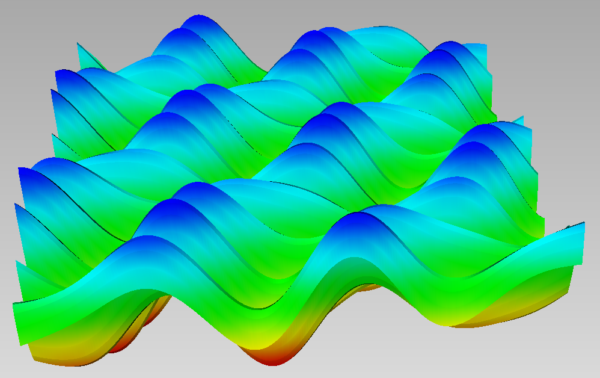

# Multivariate exponential decompositon


```julia
using MultivariateSeries
```

We consider the following function, which is a sum of 6 complex exponentials 


```julia
f = (u,v) -> 0.5*cos(0.7*pi*(u+v))+0.6*sin(4*pi*u)-0.2*cos(pi*v);
```



In order to recover the frequencies or exponents of these exponential terms and their coefficients, we sample the function on a grid $({\alpha_1 \over T}, {\alpha_2 \over T}), \alpha=(\alpha_1,\alpha_2)\in A\subset \mathbb{N}^2$. This defines a sequence of moments $\sigma_{\alpha}=f({\alpha_1 \over T}, {\alpha_2 \over T})$. We compute its generating series truncated in degree $\leq 5$.


```julia
X = @ring x1 x2
L = monoms(X,5)
T = 10
mnt = (V->f(V[1]/T,V[2]/T))
sigma = series(mnt, L)
```


    0.2569085959993554dx2^4 - 0.22417045976016967dx1^3dx2 + 0.7358257607718759dx1*dx2^4 + 0.8585922907464658dx1 + 0.5575373543042985dx1^2dx2 + 0.46210935078676274dx1^2dx2^3 + 0.6050846776084937dx1^2 + 0.02699524986977328dx1^5 - 0.15759364518763863dx1^3 + 0.2775204557293506dx2^3 + 0.29774707771034303dx2 - 0.2874793003806999dx1^3dx2^2 + 0.5095797473748392dx1^2dx2^2 + 0.2906101273580203dx2^2 + 0.7717888541929423dx1*dx2^3 + 0.22699524986977343dx2^5 - 0.5338499631663495dx1^4dx2 + 0.8328361327510712dx1*dx2 + 0.8039080170899477dx1*dx2^2 - 0.4519219149027473dx1^4 + 0.3


Computing its decomposition using svd


```julia
w, Xi = decompose(sigma);
```

yields the weights $\omega$ of the exponential terms in f and the exponentials $\Xi$:


```julia
log.(Xi')*T/pi
```


    6×2 Array{Complex{Float64},2}:
     6.84243e-12+1.89601e-12im  -1.46851e-12-1.0im        
     6.84243e-12-1.89601e-12im  -1.46851e-12+1.0im        
     1.88616e-12-0.7im           4.84085e-13-0.7im        
     1.88616e-12+0.7im           4.84085e-13+0.7im        
     8.94708e-13-4.0im          -2.79182e-13+8.46664e-15im
     8.94708e-13+4.0im          -2.79182e-13-8.46664e-15im


By taking the log and scaling by ${T\over \pi}$, we recover the frequency vectors within precision $1O^{-11}$. 


```julia
w
```


    6-element Array{Complex{Float64},1}:
      0.08650714237109196 + 0.05016487136224489im
      0.08650714237109196 - 0.05016487136224486im
     -0.17203277153436108 - 0.18139659731722088im
      -0.1720327715343611 + 0.18139659731722083im
     -0.16999220553356456 - 0.24718950232123527im
     -0.16999220553356453 + 0.2471895023212353im 


