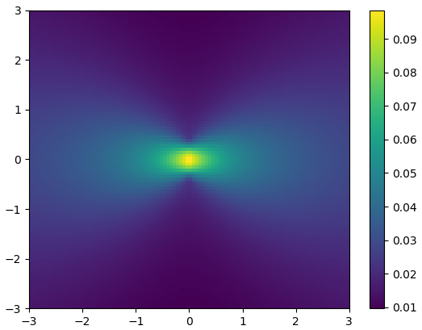

# Incident Field Types

ParticleScattering solves the multiple-scattering equation in the cylindrical
wave domain, and thus a transformation is necessary in order to solve for arbitrary incident fields. The following field types are currently supported:

## Plane Wave

A TM plane wave with angle ``\theta_i`` relative to the x-axis is represented by
```math
E_z^{\mathrm{inc}} (\mathbf{r}) = e^{ik(\cos \theta_i, \, \sin \theta_i) \cdot \mathbf{r}},
```
and constructed by calling `PlaneWave(θ_i)`.

## Line Current

```math
E_z^{\mathrm{inc}} (\mathbf{r}) = \frac{i}{4} H_0^{(1)} (k|\mathbf{r} - (x_0, y_0)|)
```

Following standard notation, this is a line current with total current ``I = i/k \eta``. This source cannot be placed inside a particle, and is constructed with `LineSource(x0, y0)`.

## Current Source

A straight line containing an arbitrary single potential density `\sigma`, producing the following incident field:

```math
E_z^{\mathrm{inc}} (\mathbf{r}) = \frac{i}{4} \int \sigma(\mathbf{r}') H_0^{(1)} (k|\mathbf{r} - \mathbf{r}'|) \, \mathrm{d}\mathbf{r}'
```

The current density of this source is ``J_z = i \sigma /k \eta ``. Current
sources must lie completely outside all particles, and are contructed with `CurrentSource(x1, y1, x2, y2, σ)`, where `(x1,y1)` and `(x2,y2)` denote the start and end points, and `σ` is an array containing the single layer potential density at equidistant points along the source. For example,
```julia
using ParticleScattering, PyPlot
λ = 1
yc = range(-0.5λ, stop=0.5λ, length=100)
ui = CurrentSource(0, -0.5λ, 0, 0.5λ, cos.(π*yc/λ))
#now plot
x_points = 100; y_points = 100
x = range(-3λ, stop=3λ, length=x_points + 1)
y = range(-3λ, stop=3λ, length=y_points + 1)
xgrid = repeat(transpose(x), y_points + 1)
ygrid = repeat(y, 1, x_points + 1)
points = cat(2, vec(xgrid[1:y_points, 1:x_points]) + 3λ/x_points,
            vec(ygrid[1:y_points, 1:x_points]) + 3λ/y_points)
u = uinc(2π/λ, points, ui)
pcolormesh(xgrid, ygrid, abs.(reshape(u, y_points, x_points)))
colorbar()
```
yields the figure
```@raw html
<div style="text-align:center">

</div>
```
