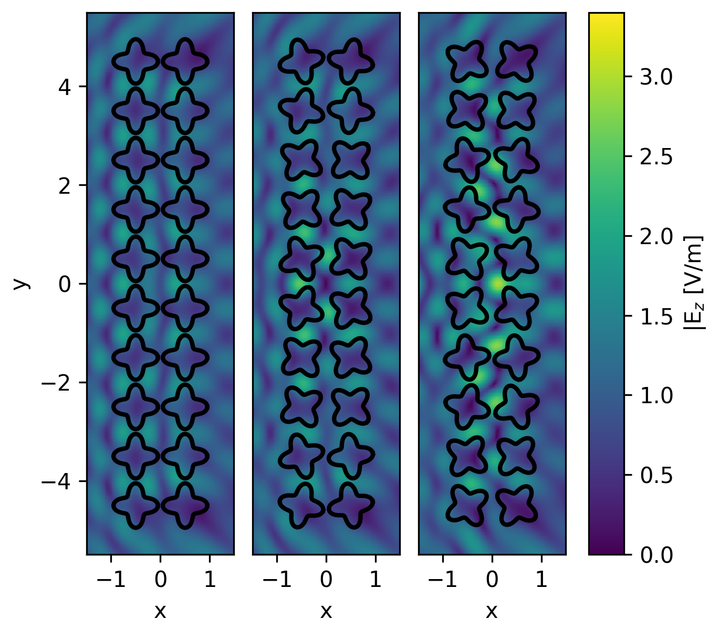
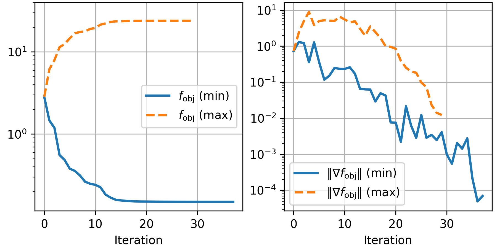

#  [Tutorial 3: Angle Optimization](@id tutorial3)

In this tutorial, we build upon the [previous tutorial](@ref tutorial2) by
optimizing the rotation angles of the particles (`φs`) to maximize the field
intensity at a specific point.
Depending on the scattering problem, wavelengths, and incident field,
optimization can have a major or minor impact on the field.
The simplest way to perform this optimization is by calling [`optimize_φ`](@ref), which
in turn utilizes `Optim`, a Julia package for nonlinear optimization. The type of
objective function handled here is given by

```math
f_{\mathrm{obj}} = \sum_{\mathbf{r} \in I} \| u(\mathbf{r})\|^2
```

where ``I`` is a set of points that lie outside all scattering discs
and ``u`` is the ``z``-component of the electric field. This function can be
minimized directly, or maximized by minimizing ``-f_{\mathrm{obj}}``.

First we set up our scattering problem:

```julia
λ0 = 1 #doesn't matter since everything is normalized to λ0
k0 = 2π/λ0
kin = 0.5k0
θ_i = 0 #incident wave e^{i k_0 (1/sqrt{2},1/sqrt{2}) \cdot \mathbf{r}}
pw = PlaneWave(θ_i)
M = 20
shapes = [rounded_star(0.35λ0, 0.1λ0, 4, 202)]
P = 12
centers =  rect_grid(2, div(M,2), λ0, λ0) #2xM/2 grid
ids = ones(Int, M)
φs0 = zeros(M)
sp = ScatteringProblem(shapes, ids, centers, φs0)
fmm_options = FMMoptions(true, acc = 6, dx = 2λ0)
points = 0.05*λ0*[-1 0; 1 0; 0 1; 0 -1]
```

where `φs0` is the starting point for the optimization method, and `points` are
the locations at which we intend to maximize or minimize the field intensity.
In this case, we want to optimize intensity at a small area around the origin.
We now select the optimization method and select its options.
In most cases, BFGS with the default linesearch will yield accurate results in
fast time; optimizing with `adjoint = false` requires a backtracking linesearch
to reduce gradient evaluations. The possible convergence
criteria are set by the bounds `f_tol`, `g_tol`, and `x_tol`, for
a relative change in the function, gradient norm, or variables, respectively.
In addition, we can set a maximum number of `iterations`. Verbosity of the output
is set with `show_trace` and `extended_trace`.

```julia
import Optim
optim_options = Optim.Options(f_tol = 1e-6, iterations = 100,
                    store_trace = true, show_trace = true)
optim_method = Optim.BFGS()
```

We now run both minimization and maximization:

```julia
res_min = optimize_φ(φs0, points, P, pw, k0, kin, shapes, centers, ids,
            fmm_options, optim_options, optim_method; minimize = true)
res_max = optimize_φ(φs0, points, P, pw, k0, kin, shapes, centers, ids,
            fmm_options, optim_options, optim_method; minimize = false)
sp_min = ScatteringProblem(shapes, ids, centers, res_min.minimizer)
sp_max = ScatteringProblem(shapes, ids, centers, res_max.minimizer)
```

Once the optimization is done, we can visualize each `ScatteringProblem`
separately with [`plot_near_field`](@ref) or compare them side by side with the
following PyPlot code:

```julia
border = find_border(sp, points)
plts = Array{Any}(undef, 3)
for (i,spi) in enumerate([sp;sp_min;sp_max])
    global plts[i] = plot_near_field(k0, kin, P, spi, pw, x_points = 100,
                        y_points = 300, opt = fmm_options, border = border)
end

using PyPlot
fig, axs = subplots(ncols=3, figsize=[4.5,4])
for (i, spi) in enumerate([sp;sp_min;sp_max])
    global msh = axs[i].pcolormesh(plts[i][2][1], plts[i][2][2], abs.(plts[i][2][3]),
                        vmin = 0, vmax = 3.4, cmap="viridis")
    draw_shapes(spi, ax = axs[i])
    axs[i].set_aspect("equal", adjustable = "box")
    axs[i].set_xlim([border[1];border[2]])
    axs[i].set_ylim([border[3];border[4]])
    axs[i].set_xticks([-1,0,1])
    i > 1 && axs[i].set_yticks([])
    axs[i].set_xlabel("x")
end
axs[1].set_ylabel("y")
subplots_adjust(left=0.12, right=0.8, top=0.98, bottom = 0.12, wspace = 0.1)
cbar_ax = fig.add_axes([0.83, 0.12, 0.05, 0.86])
fig.colorbar(msh, cax=cbar_ax)
cbar_ax.set_ylabel("|E\$_z\$ [V/m]")
```
```@raw html
<div style="text-align:center">

</div><p style="clear:both;">
```

From left to right, we see the electric field before optimization, after
minimization, and after maximization. The field intensity at the origin is
notably different in both optimization results, with minimization decreasing
the intensity at `points` by 77%, and maximization almost tripling it.
The convergence of the optimization method for both examples can be plotted via:

```julia
iters = length(res_min.trace)
fobj = [res_min.trace[i].value for i=1:iters]
gobj = [res_min.trace[i].g_norm for i=1:iters]
iters2 = length(res_max.trace)
fobj2 = -[res_max.trace[i].value for i=1:iters2]
gobj2 = [res_max.trace[i].g_norm for i=1:iters2]

fig, axs = subplots(ncols=2, figsize=[6,3])
axs[1].semilogy(0:iters-1, fobj, linewidth=2)
axs[2].semilogy(0:iters-1, gobj, linewidth=2)
axs[1].semilogy(0:iters2-1, fobj2, linewidth=2, "--")
axs[2].semilogy(0:iters2-1, gobj2, linewidth=2, "--")
axs[1].legend(["\$f_\\mathrm{obj}\$ (min)";
                "\$f_\\mathrm{obj}\$ (max)"], loc="right")
axs[2].legend(["\$\\Vert \\nabla f_\\mathrm{obj}\\Vert\$ (min)";
                "\$\\Vert \\nabla f_\\mathrm{obj}\\Vert\$ (max)"], loc="best")
axs[1].set_xlabel("Iteration")
axs[2].set_xlabel("Iteration")
axs[1].set_ylim(ymax=40)
axs[1].grid(); axs[2].grid()
subplots_adjust(top=0.99, right=0.99, left=0.07, bottom=0.15)
```

```@raw html
<p style="text-align:center;"></p>
```
