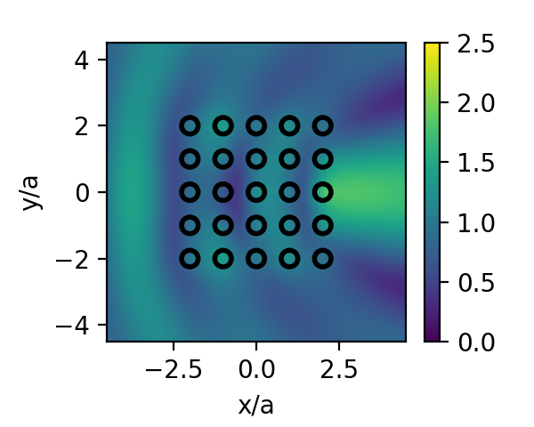
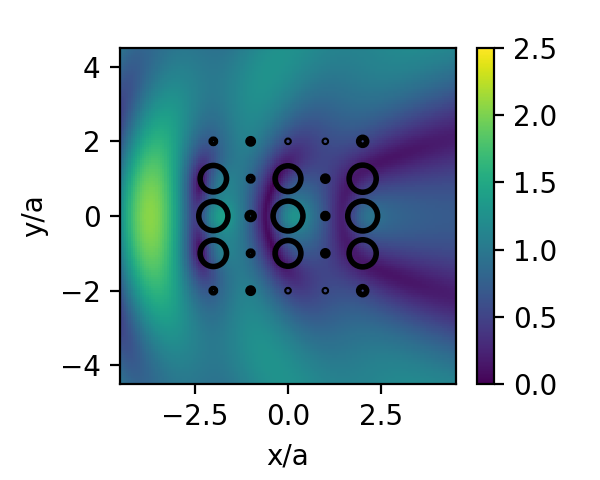
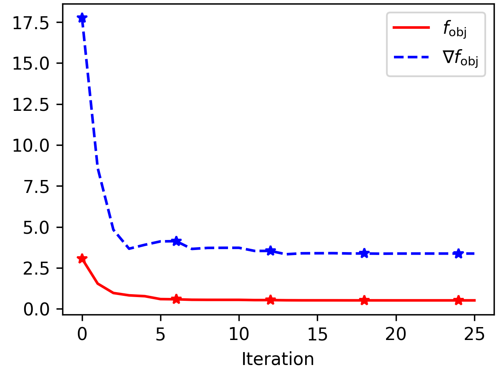

#  Tutorial 4: Radius Optimization

In this tutorial, we explore radius optimization, whereby the radii of a group
of circular particles are optimized simultaneously to minimize or maximize the
electric field intensity at a group of points.

We begin by defining a standard scattering scenario with a ``5 \times 5`` square
grid of particles:

```julia
using PyPlot, ParticleScattering
import Optim

er = 4.5
k0 = 2π
kin = sqrt(er)*k0
a = 0.2*2π/k0     #wavelength/5
θ_i = 0.0
pw = PlaneWave(θ_i)
P = 5
centers = square_grid(5, a)
φs = zeros(size(centers,1))
fmm_options = FMMoptions(true, acc = 6, dx = 2a)
```

[`optimize_radius`](@ref) not only allows us to optimize all of the radii simultaneously,
but also to assign several particles the same `id`, which can be useful when the
target radii are expected to have symmetry of some type.
Here we shall assume symmetry with respect to the ``x``-axis with `uniqueind`:

```julia
# let's impose symmetry wrt x-axis
centers_abs = centers[:,1] + 1im*abs.(centers[:,2])
ids, centers_abs = uniqueind(centers_abs)
J = maximum(ids) #number of optim vars
```

The same could be done for the ``y``-axis, both axes simultaneously, or
radial symmetry, by appropriately choosing `center_abs`.
We now define the optimization parameters via `Optim.Options`, with convergence
decided by the radii and a limited number of 5 outer iterations (with up to 5
inner iterations each).
We choose to minimize the field intensity at a single point outside the
structure, assert that this point will remain outside the particles regardless
of their size, and set the lower and upper bounds for each circle:

```julia
optim_options =  Optim.Options(x_tol = 1e-6, outer_x_tol = 1e-6,
                               iterations = 5, outer_iterations = 5,
                               store_trace = true, show_trace = true,
                               allow_f_increases = true)

points = [4a 0.0]
r_max = (0.4*a)*ones(J)
r_min = (1e-3*a)*ones(J)
rs0 = (0.25*a)*ones(J)
@assert verify_min_distance(CircleParams.(r_max), centers, ids, points)
```

The optimization process is initiated by running:

```julia
res = optimize_radius(rs0, r_min, r_max, points, ids, P, pw, k0, kin,
                centers, fmm_options, optim_options, minimize = true)
rs = res.minimizer
```

With the optimization process complete, we can plot the electric field with the
initial and optimized radii:

```julia
sp1 = ScatteringProblem(CircleParams.(rs0), ids, centers, φs)
plot_near_field(k0, kin, P, sp1, pw, x_points = 150, y_points = 150,
        opt = fmm_options, border = 0.9*[-1;1;-1;1], normalize = a)
colorbar()
clim([0;2.5])
xlabel("x/a")
ylabel("y/a")
sp2 = ScatteringProblem(CircleParams.(rs), ids, centers, φs)
plot_near_field(k0, kin, P, sp2, pw, x_points = 150, y_points = 150,
        opt = fmm_options, border = 0.9*[-1;1;-1;1], normalize = a)
colorbar()
clim([0;2.5])
xlabel("x/a")
ylabel("y/a")
```

```@raw html
<div style="text-align:center">


</div><p style="clear:both;">
```

`res` also stores the objective value as well as the g
radient norm in each iteration.
This can be extracted by

```julia
inner_iters = length(res.trace)
iters = [res.trace[i].iteration for i=1:inner_iters]
fobj = [res.trace[i].value for i=1:inner_iters]
gobj = [res.trace[i].g_norm for i=1:inner_iters]
rng = iters .== 0
```
where `rng` now contains the indices at which a new outer iteration has begun.
Finally, plotting `fobj` and `gobj` for this example yields the following plot:

```@raw html
<p style="text-align:center;"></p>
```

where markers denote the start of an outer iteration.
