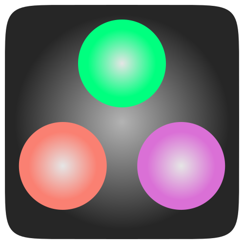

# PhilipsHue



A few simple functions to control Philips Hue light bulbs from Julia.

Uses JSON, HTTP, and Colors packages.

## Summary

To access and control the bridge you need to know its IP address, and register and obtain a 'username' (a string of hex) which you can use in subsequent sessions.

### If you haven't used your PhilipsHue bridge before

For the very first run:

    using PhilipsHue
    B = PhilipsHueBridge("192.168.1.2")
    initialize(B, devicetype="juliascript#user1")

You'll now have to run to the Hue bridge and hit the button:

    julia> initialize(B, devicetype="juliascript#user1")
    initialize(): Trying to get the IP address of the Philips bridge.
    initialize(): Found bridge at 192.168.1.2.
    initialize(): Trying to register juliascript#user1 with the bridge at 192.168.1.2...
    register(): Quick, you have ten seconds to press the button on the bridge!
    register(): Successfully registered juliascript#user1 with the bridge at 192.168.1.2
    register(): username is KbZxj8G5nBDsDYgqOmHicytLC-aTALLSEaJN
    initialize(): Registration successful
    your username is KbZxj8G5nBDsDYgqOmHicytLC-aTALLSEaJN
    true

and the 'username' should also be stored in a field of B. Remember it!

    testlights(B)

``B`` now refers to your bridge, and most of the functions require this as the first argument.

### Once you know your username

In a subsequent Julia session, or if you already know your username, you don't have to do this initialization, and can simply do:

    using PhilipsHue
    B = PhilipsHueBridge("192.168.1.2", "KbZxj8G5nBDsDYgqOmHicytLC-aTALLSEaJN")
    testlights(B)

since you remembered that 'username'.

## Try it out

You can now try:

```julia
isinitialized(B) # returns true if correctly initialized

getbridgeinfo(B) # returns a dictionary with information about the bridge

getlight(B, 1)   # return a dictionary of information about light #1

getlights(B) # return a dictionary with info about all lights on the bridge

getlightnumbers(B) # return array of the "logical" light numbers

# set the color of light #1:
setlight(B, 1, Dict("sat" => 128, "on" => true, "hue" => 20000, "bri" => 200))

using Colors
setlight(B, 1, colorant"Pink")

# set all the lights to the same settings
setlights(B, Dict("sat" => 128, "on" => true, "hue" => 20000, "bri" => 200))

# quickly test lights for say 20 repetitions
testlights(B, 20)

# cycle colors for all colored lights with delay 1 repetitions 10
randomcolors(B, 1, 10)
```

## Setting light parameters

To set the parameters of a light, pass a dictionary with one or more key/value pairs to one of the `set` functions. Typically this dict is something like this:

```
Dict{Any,Any}("bri" => rand(0:255), "hue" => rand(1:65000), "sat" => rand(1:255))
```

where "sat" and "bri" values are saturation and brightness from 0 to 255, and "hue" is from 0 to 65280 (?), where 0 is red, yellow is 12750, green is 25500, blue is 46920, etc. If any keys are omitted, that aspect of the light won't be changed. Keys are strings, values can be numeric and will get converted to strings.

```
setlight(B, 1, Dict("on" => false))
setlight(B, 1, Dict("on" => true, "hue" => 10000))

setlights(B,   Dict("sat" => 255, "bri" => 255, "hue" => 20000, "on" => true))
setlights(B,   Dict("sat" => 25,  "on" => true))
setlights(B,   Dict("sat" => "25",  "on" => true))
```

Using the definitions and conversions in Colors.jl, you can do things like this:

```
using Colors
setlight(B, 1, RGB(1, 0.3, 0.6))
setlight(B, 1, colorant"Pink")
```

## Getting information

Note that light numbers are not necessarily consecutive, or numbered from 1. For example, if you have four lights, their numbers might be `[1, 3, 6, 9]`. You can use `getlightnumbers()` to get the numbers of lights connected to the bridge:

```
getlightnumbers(bridge::PhilipsHueBridge)
```

which returns eg:

```
[1, 3, 5, 6]
```

Get information for a specific light. For example:

```
getlight(B, 2)
```

returns `(true,25,254,15000)` - On, Saturation, Brightness, Hue

Get the bridge's current registered IP address (which can usually be read from `http://meethue.com` using `get("https://www.meethue.com/api/nupnp")`):

```
getIP()
```

Get the current bridge configuration:

```
getbridgeconfig(B)
```

which returns a dictionary with keys such as "timezone", "apiversion", "paddles", "whitelist", and so on. You can obtain specific values:

```julia
getbridgeinfo(B)["apiversion"]
```

returns

```
"1.29.0"
```

A list of current approved apps and users is stored in the whitelist:

```julia
getbridgeinfo(B, "config")["whitelist"]
```
```
Dict{AbstractString,Any} with 25 entries:
  "lSsXQfrm7rC32SQ0"                 => Dict{AbstractString,Any}("name"=>"fred’s iPhone","last use date"=>"2015-08-27T10:32:24","create date"=>"2013-12-31T14:05:05")
  "352f5a4637d93da7121471aa39dc2db"  => Dict{AbstractString,Any}("name"=>"Harmony","last use date"=>"2014-10-13T04:56:30","create date"=>"2014-09-06T12:15:28")
  "5F062ECE840DB0FE8D468855570D2EB9" => Dict{AbstractString,Any}("name"=>"QuickHue","last use date"=>"2014-01-09T14:47:13","create date"=>"2014-01-01T12:24:36")
  "0f607264fc6318a92b9e13c65db7cd3c" => Dict{AbstractString,Any}("name"=>"fred’s iPad","last use date"=>"2014-01-03T00:13:28","create date"=>"2013-12-31T13:10:36")
  "hue-js-JkRkZIa8Lasd"              => Dict{AbstractString,Any}("name"=>"Philips hue JavaScript","last use date"=>"2015-06-12T13:34:00","create date"=>"2015-06-12T13:26:00")
  "newjuliauser2"                    => Dict{AbstractString,Any}("name"=>"test developer","last use date"=>"2014-09-21T14:30:18","create date"=>"2014-09-21T13:40:11")
  "q3a619KRfwoS6suF"                 => Dict{AbstractString,Any}("name"=>"HueForAppleWatch#fred’s iPhone 6","last use date"=>"2015-08-20T22:47:41","create date"=>"2015-08-20T16:50:32")
  "juliauser1"                       => Dict{AbstractString,Any}("name"=>"juliascript","last use date"=>"2015-08-27T15:06:43","create date"=>"2014-09-21T10:30:53")
  ...
```

Get information for all lights:

```julia
getlights(B)
```

For example:

```julia
getlights(B)
```
```
Dict{String,Any} with 3 entries:
  "1" => ["name"=>"Hue Lamp","swversion"=>"66010820","pointsymbol"=>["8"=>"none","4"=>"none","1"=>"none","5"=>"none",…
  "2" => ["name"=>"Hue Lamp 1","swversion"=>"66010820","pointsymbol"=>["8"=>"none","4"=>"none","1"=>"none","5"=>"none…
  "3" => ["name"=>"Hue Lamp 2","swversion"=>"66010820","pointsymbol"=>["8"=>"none","4"=>"none","1"=>"none","5"=>"none…
```
