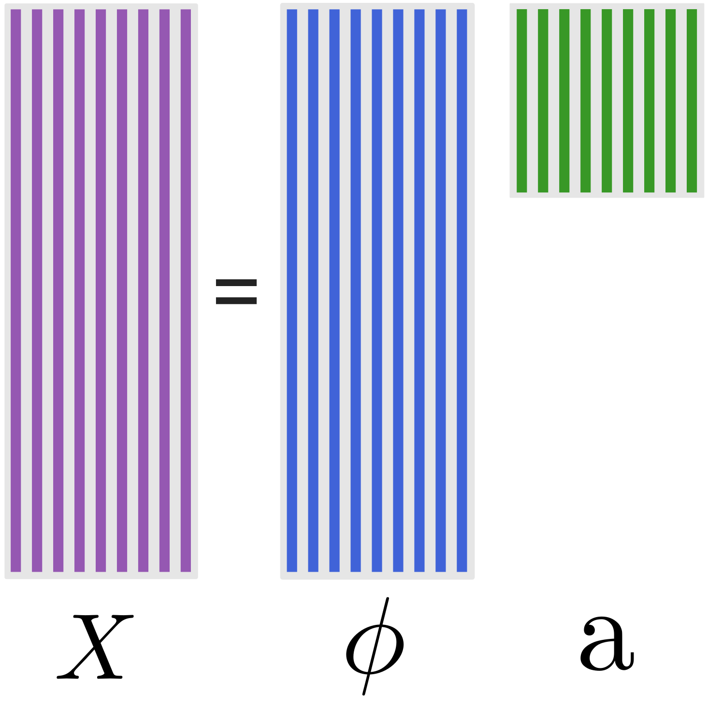

# ProperOrthogonalDecomposition.jl

| **Documentation** | **Build & Testing Status** |
|:-----------------:|:--------------------------:|
[![][docs-stable-img]][docs-stable-url] | [](https://travis-ci.org/MrUrq/ProperOrthogonalDecomposition.jl) [](https://coveralls.io/github/MrUrq/ProperOrthogonalDecomposition.jl?branch=master) [](http://codecov.io/github/MrUrq/ProperOrthogonalDecomposition.jl?branch=master) | 

*ProperOrthogonalDecomposition* is a Julia package for performing the Proper Orthogonal modal Decomposition (POD) technique. The POD methods available in this package is the Singular Value Decomposition (SVD) based method and the eigen-decomposition based *method of snapshots*. The method of snapshots is the most
commonly used method for fluid flow analysis where the number of datapoints is larger than the number of snapshots.

The POD technique goes under several names; Karhunen-Loèven (KL), Principal Component Analysis (PCA) and Hotelling analysis. The method has been used for error analysis, reduced order modeling, fluid flow reconstruction, turbulent flow feature extraction, among others. A descriptive overview of the method is given in reference [1].

Features:

* SVD and Eigen based methods for POD.
* Weighted POD, useful for non-uniform sampling grids.
* Convergence framework, useful for estimating neccesary sampling frequency and time.

## Installation
The package is registered and can be installed with `Pkg.add`.

```julia
julia> Pkg.add("ProperOrthogonalDecomposition")
```

## Documentation

- [**LATEST**][docs-stable-url] &mdash; **tagged version of the documentation.**


## Author

- Magnus Urquhart - [@MrUrq](https://github.com/MrUrq/)

[docs-stable-img]: https://img.shields.io/badge/docs-latest-blue.svg
[docs-stable-url]: https://MrUrq.github.io/ProperOrthogonalDecomposition.jl/latest

### Reference
[1]: Taira et al. "Modal Analysis of Fluid Flows: An Overview", arXiv:1702.01453 [physics], () http://arxiv.org/abs/1702.01453

