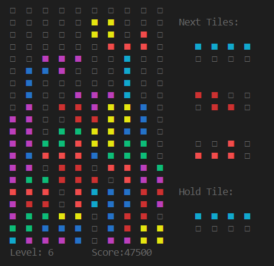

# REPLTetris.jl
This started as an exercise to learn terminal rendering and key-input. Tile-colors, scoring, button-mapping, speed and levels are in accordance to the [Tetris Guideline][1]. T-spins and wall kicks are not yet available, but will be added soon.

This is a screenshot playing in the VSCode REPL:



# Installation & Usage
The package is registered in Meta-Data. Simply install it using `Pkg.add`:
```julia
julia> Pkg.add("REPLTetris")
```

After using the Package, you can start a game with `tetris()`:

```julia
julia> using REPLTetris
julia> tetris()
```

The game is controlled via arrow-keys, X, Z and space:
- `Up`: Rotate Clockwise
- `Left` / `Right` / `Down`: Move Current Tile
- `Space`: Drop Current Tile to Bottom
- `X`: Rotate Clockwise
- `Z`: Rotate Counter Clockwise
- `C`: Swap current tile with tile on hold
- `CTRL-C`: Abort Game

[1]: http://tetris.wikia.com/wiki/Tetris_Guideline
