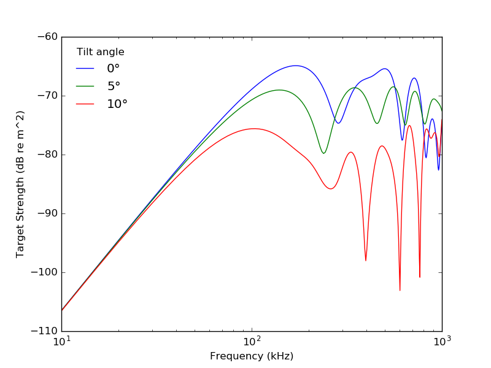

# SDWBA.jl

[](https://travis-ci.org/ElOceanografo/SDWBA.jl)

[](https://ElOceanografo.github.io/SDWBA.jl/stable)
[](https://ElOceanografo.github.io/SDWBA.jl/dev)

[](https://zenodo.org/badge/latestdoi/21069/ElOceanografo/SDWBA.jl)

This Julia package implements the (stochastic) distorted-wave Born approximation for 
acoustic scattering from fluid-like objects shaped like distorted cylinders.  These
models are useful for modeling the acoustic target strengths (TS) of zooplankton, which
are needed to convert sonar echoes to estimates of biomass.


The full documentation and function reference can be found at [here](https://eloceanografo.github.io/SDWBA.jl/dev).  A short demo is given below:

To install and load it, simply run

```julia
Pkg.add("SDWBA")
using SDWBA
```

Several models of common animals are included.  To calculate the TS of an Antarctic krill,
*Euphausia superba*:

```julia
krill = Models.krill_mcgeehee
freq = 120e3	# acoustic frequency (kHz)
c = 1456		# sound speed in water (m/s)
target_strength(krill, freq, c)
# -66.9
``` 

Functions are included to tilt/rotate scatterers, as well as to resize them:

```julia
krill2 = rescale(krill, 0.8) # shrink the krill by 20%
krill2 = rotate(krill2, tilt = 45) # tilt it 45 degrees nose-up
target_strength(krill2, freq, c)
# -100.09
```

Often, we are interested in how an animal scatters across a range of frequencies or tilt angles. Two convenience functions, `tilt_spectrum` and `freq_spectrum`, are included to do this easily.  For instance, we can take our krill and examine its frequency-response curves at a few different tilt angles:

```julia
start, stop = 10e3, 1000e3 # endpoints of the spectrum, in Hz
nfreqs = 200
fs0 = freq_spectrum(krill, start, stop, c, nfreqs)
fs5 = freq_spectrum(rotate(krill, tilt=5), start, stop, c, nfreqs)
fs10 = freq_spectrum(rotate(krill, tilt=10), start, stop, c, nfreqs)

using PyPlot # for plotting functions
semilogx(fs0["freqs"] / 1000, fs["TS"])
semilogx(fs5["freqs"] / 1000, fs5["TS"])
semilogx(fs10["freqs"] / 1000, fs10["TS"])
xlabel("Frequency (kHz)")
ylabel("Target Strength (dB re m^2)")
legend(("0°", "5°", "10°"), title="Tilt angle", loc="upper left", frameon=false)
```



As expected, the target strength is lower at greater tilt angles, and the differences are more pronounced at higher freqencies in the geometric scattering region.
