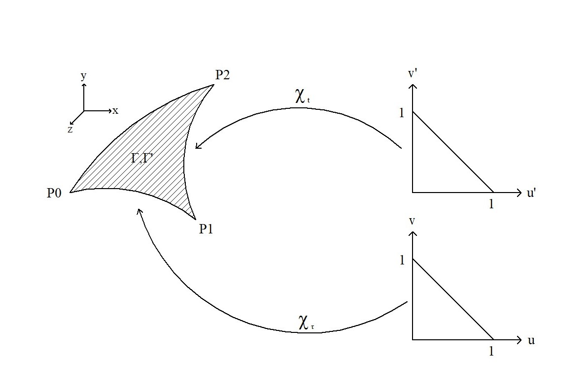
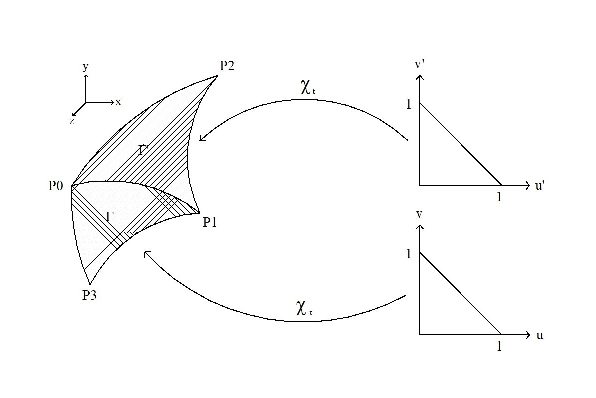
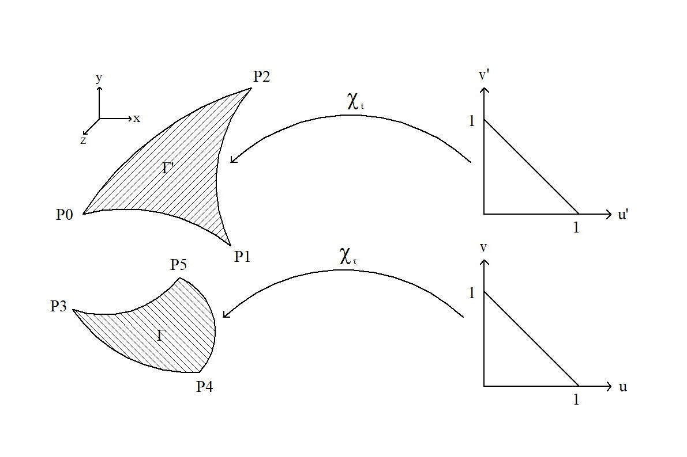

# Parameterized


The called function in this implementation looks like:

`sauterschwab_parameterized(integrand, method)`.

As on the homepage already mentioned, the user now has to parameterize the integration areas by himself; that means, that `integrand` is no more the original function that has to be integrated; `integrand` is now the parameterized version of the original integrand, including the two surface elements of both charts.

Before the parameterizations/charts (parameterization = chart) are built, the user has to figure out which integration method should be applied, and decide how accurate the integration shall be done. It is recommended, that the user read the page 'Non-Parameterized' before continuing to read here. Because otherwise, he may not be able to apply the concepts of 'integration method' and 'accuracy'.

The parameterization of the sourcetriangle will be called ``\chi_t``, and the parameterization of the testtriangle will be called ``\chi_\tau``. In the following, the parameterization of every single integration method will be presented.


## Common Face

``\Gamma`` and ``\Gamma'`` are equal, and both parameterizations must be equal as well: ``\chi_t(u',v') = \chi_\tau(u,v)``.



The user's task is to find a parameterization which maps the reference triangle (right) onto the real triangle (left). The reference triangle is throughout this package always the same.

The original integrand, which is a function of ``\textbf{x}`` and ``\textbf{y}``, becomes:

```math
f(\chi_\tau(u,v),\chi_t(u',v')) \cdot \|\frac{\partial \chi_\tau}{\partial u}\times\frac{\partial \chi_\tau}{\partial v}\| \cdot\|\frac{\partial \chi_t}{\partial u'}\times\frac{\partial \chi_t}{\partial v'}\|
```.

This function method as well as the following methods, transform the two area integrals in parameters domain into four 1D integrals from zero to one; therefore, the last argument is created by

`cf = CommonFace(x)`.

`cf` is an object of type `CommonFace()`; x is the number of quadrature points on the integration path ``[0,1]``.

An example for this case can be found in the common_face_parameterized.jl file in the examples folder.


## Common Edge

``\Gamma`` and ``\Gamma'`` have an edge in common, and both parameterizations must fulfill the condition ``\chi_t(s,0) = \chi_\tau(s,0)``. For example, this condition could be met if the points ``(u\in[0,1];0)`` and ``(u'\in[0,1];0)`` are mapped on the same point on the common edge.



The modified integrand looks like in the case Common Face.

The last argument can be created by

`ce = CommonEdge(x)`.

`ce` is an object of type `CommonEdge()`; x is the number of quadrature points on the integration path ``[0,1]``.

An example for this case can be found in the common_edge_parameterized.jl file in the examples folder.


## Common Vertex

``\Gamma`` and ``\Gamma'`` have one vertex in common, and both parameterizations must fulfill the condition ``\chi_t(0,0) = \chi_\tau(0,0)``. This condition means, that the origin of both reference triangles is mapped on the common vertex.


The modified integrand looks like in the case Common Face.

The last argument can be created by

`cv = CommonVertex(x)`.

`cv` is an object of type `CommonVertex()`; x is the number of quadrature points on the integration path ``[0,1]``.

An example for this case can be found in the common_vertex_parameterized.jl file in the examples folder.


## Positive Distance

The two triangles do not touch at all, and both parameterizations only need to map from the reference triangle onto the real triangle.



The modified integrand looks like in the case Common Face.

The last argument can be created by

`pd = PositiveDistance(x)`.

`pd` is an object of type `PositiveDistance()`; x is the number of quadrature points on the integration path ``[0,1]``.

An example for this case can be found in the positive_distance_parameterized.jl file in the examples folder.
