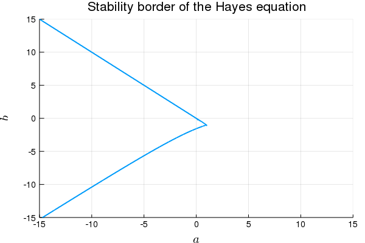
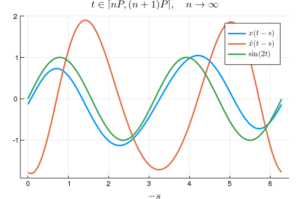
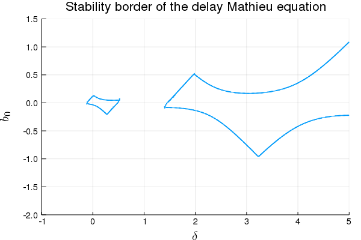

# SemiDiscretizationMethod.jl

Julia package to investigate the behaviour of linear delay differential equations based on the book 
[Semi-Discretization for Time-Delay Systems (by Insperger and Stepan)](http://link.springer.com/10.1007/978-1-4614-0335-7).

This package provides a tool to approximate the stability properties and stationary behaviour of linear periodic delay systems of the form:

<!-- $$\dot{\mathbf{x}}(t) = \mathbf{A}(t) \mathbf{x}(t) + \sum_{j=1}^g \mathbf{B}_j(t) \mathbf{x}(t-\tau_j(t))+\mathbf{c}(t)$$ -->


by transforming the underlying differential equation into the mapping:
<!-- $$\mathbf{y}_{n+1} = \mathbf{F}_n\mathbf{y}_n+\mathbf{f}_n,$$ -->

<a href="https://www.codecogs.com/eqnedit.php?latex=\mathbf{y}_{n&plus;1}&space;=&space;\mathbf{F}_n\mathbf{y}_n&plus;\mathbf{f}_n," target="_blank"></a>

where <!-- $n$ -->
<a href="https://www.codecogs.com/eqnedit.php?latex=n" target="_blank"></a>
is the discrete time <!-- ($t_n = n \Delta t$) -->
<a href="https://www.codecogs.com/eqnedit.php?latex=(t_n&space;=&space;n&space;\Delta&space;t)" target="_blank"></a>
, <!-- $\mathbf{F}_n$ -->
<a href="https://www.codecogs.com/eqnedit.php?latex=\mathbf{F}_n" target="_blank"></a>
 is the mapping matrix constructed using <!-- $\mathbf{A}(t)$ -->
<a href="https://www.codecogs.com/eqnedit.php?latex=\mathbf{A}(t)" target="_blank"></a>
, <!-- $\mathbf{B}(t)$ -->
<a href="https://www.codecogs.com/eqnedit.php?latex=\mathbf{B}(t)" target="_blank"></a>
and <!-- $\tau_j(t)$ -->
<a href="https://www.codecogs.com/eqnedit.php?latex=\tau_j(t)" target="_blank"></a>
, while the vector <!-- $\mathbf{y}_n$ -->
<a href="https://www.codecogs.com/eqnedit.php?latex=\mathbf{y}_n" target="_blank"></a>
is the discretized state space vector:

<!-- $$ \mathbf{y}_n = \left(\mathbf{x}(t_n)^\top, \mathbf{x}(t_{n-1})^\top,\ldots,\mathbf{x}(t_{n-r})\right)^\top\!.$$ -->
<a href="https://www.codecogs.com/eqnedit.php?latex=\mathbf{y}_n&space;=&space;\left(\mathbf{x}(t_n)^\top,&space;\mathbf{x}(t_{n-1})^\top,\ldots,\mathbf{x}(t_{n-r})\right)^\top\!." target="_blank"></a>

Each coefficient matrices of delay differential equations are periodic, with a principle period of <!-- $P$ -->
<a href="https://www.codecogs.com/eqnedit.php?latex=P" target="_blank"></a>
, namely:
<!-- $A(t)=A(t+P),\; B_j(t)=B_j(t+P),\; \tau_j(t)=\tau_j(t+P)$) and $c(t)=c(t+P)$ -->

Furthermore, the integer <!-- $r$ -->
<a href="https://www.codecogs.com/eqnedit.php?latex=r" target="_blank"></a>
is chosen in a way, that <!-- $r\Delta t\geq \max_{t \in \left[0,P\right],j=1\ldots g}\tau_j(t)$ -->
<a href="https://www.codecogs.com/eqnedit.php?latex=\inline&space;r\Delta&space;t\geq&space;\max_{t&space;\in&space;\left[0,P\right],j=1\ldots&space;g}\tau_j(t)" target="_blank"></a>
 (the discretized "history function" contains all possible delayed values).  

With the use of the discrete mapping, the stability of the original system can be investigated (approximately), by the spectral radius <!-- $\rho$ -->
<a href="https://www.codecogs.com/eqnedit.php?latex=\rho" target="_blank"></a>
 of the product of the mapping matrices <!-- $\mathbf{F}_n$ -->
<a href="https://www.codecogs.com/eqnedit.php?latex=\mathbf{F}_n" target="_blank"></a>
 over a period:

<!-- $$\rho\left(\prod_{i=0}^{p-1}\mathbf{F}_{n+i}\right)\left\{
    \begin{matrix}
    <1 & \Rightarrow & \text{the mapping is stable}\\
    >1 & \Rightarrow & \text{the mapping is unstable}
    \end{matrix}
    \right.$$ -->
1&space;&&space;\Rightarrow&space;&&space;\text{the&space;mapping&space;is&space;unstable}&space;\end{matrix}&space;\right." title="\rho\left(\mathbf{F}_{n+p-1}\cdot\mathbf{F}_{n+p-2}\cdot\ldots\cdot\mathbf{F}_{n}\right)\left\{ \begin{matrix} <1 & \Rightarrow & \text{the mapping is stable}\\ >1 & \Rightarrow & \text{the mapping is unstable} \end{matrix} \right." />

Furthermore, the stationary solution can be determined by the periodic fix point (stationary orbit) of the mapping.
# Citing

If you use this package as part of your research, teaching, or other activities, we would be grateful if you could cite the book it is based on (BibTeX entry):
```
@book{Insperger2011,
address = {New York, NY},
author = {Insperger, Tam{\'{a}}s and St{\'{e}}p{\'{a}}n, G{\'{a}}bor},
doi = {10.1007/978-1-4614-0335-7},
isbn = {978-1-4614-0334-0},
publisher = {Springer New York},
series = {Applied Mathematical Sciences},
title = {{Semi-Discretization for Time-Delay Systems}},
url = {http://link.springer.com/10.1007/978-1-4614-0335-7},
volume = {178},
year = {2011}
}
```

# Usage with examples
## Installation
```julia
julia> ] add SemiDiscretizationMethod
```

## Hayes equations
<!-- $$\dot{x}(t) = a \,x(t) + b \,x(t-1) + 1,$$ -->
<a href="https://www.codecogs.com/eqnedit.php?latex=\dot{x}(t)&space;=&space;a&space;\,x(t)&space;&plus;&space;b&space;\,x(t-1)&space;&plus;&space;1," target="_blank"></a>

Here 

<!-- $$ \mathbf{A}(t) \equiv \begin{bmatrix} a \end{bmatrix},
\quad \mathbf{B}_1(t) \equiv \begin{bmatrix}b\end{bmatrix},
\quad \tau_1(t) \equiv 1 , 
\quad \text{and} \quad \mathbf{c}(t) \equiv \begin{bmatrix} 1 \end{bmatrix}.$$ -->
<a href="https://www.codecogs.com/eqnedit.php?latex=\mathbf{A}(t)&space;\equiv&space;\begin{bmatrix}&space;a&space;\end{bmatrix},&space;\quad&space;\mathbf{B}_1(t)&space;\equiv&space;\begin{bmatrix}b\end{bmatrix},&space;\quad&space;\tau_1(t)&space;\equiv&space;1&space;,&space;\quad&space;\text{and}&space;\quad&space;\mathbf{c}(t)&space;\equiv&space;\begin{bmatrix}&space;1&space;\end{bmatrix}" target="_blank"></a>  
(Page 13 of the book)

```julia
using SemiDiscretizationMethod
```

```julia
function createHayesProblem(a,b)
    AMx =  ProportionalMX(a*ones(1,1));
    τ1=1. 
    BMx1 = DelayMX(τ1,b*ones(1,1));
    cVec = Additive(ones(1))
    LDDEProblem(AMx,[BMx1],cVec)
end
```

```julia
hayes_lddep=createHayesProblem(-1.,-1.); # LDDE problem for Hayes equation
method=SemiDiscretization(1,0.1) # 3rd order semi discretization with Δt=0.1
τmax=1. # the largest τ of the system
mapping=DiscreteMapping(hayes_lddep,method,τmax,n_steps=1,calculate_additive=true); #The discrete mapping of the system
```

```julia
@show spectralRadiusOfMapping(mapping); # spectral radius ρ of the mapping matrix (ρ>1 unstable, ρ<1 stable)
@show fixPointOfMapping(mapping); # stationary solution of the hayes equation (equilibrium position)

# spectralRadiusOfMapping(mapping) = 0.941189374166563
# fixPointOfMapping(mapping) = [0.5, 0.5, 0.5, 0.5, 0.5, 0.5, 0.5, 0.5, 0.5, 0.5, 0.5]
```
### Stability borders of the Hayes Equation
```julia
using MDBM

using Plots
gr();
using LaTeXStrings
```
```julia
method=SemiDiscretization(4,0.1);
τmax=1.

foo(a,b) = log(spectralRadiusOfMapping(DiscreteMapping(createHayesProblem(a,b),method,τmax,
    n_steps=1))); # No additive term calculated

axis=[Axis(-15.0:15.,:a),
    Axis(-15.0:15.,:b)]

iteration=3;
stab_border_points=getinterpolatedsolution(solve!(MDBM_Problem(foo,axis),iteration));

scatter(stab_border_points...,xlim=(-15.,15.),ylim=(-15.,15.),
    label="",title="Stability border of the Hayes equation",xlabel=L"a",ylabel=L"b",
    guidefontsize=14,tickfont = font(10),markersize=2,markerstrokewidth=0)
```

## Delay Mathieu equation
<!-- $$\ddot{x}(t) + a_1 \,\dot{x}(t)+(\delta + \varepsilon \cos(t))x(t)= b_0 \,x(t-2\pi) + \sin(2t)$$ -->
<a href="https://www.codecogs.com/eqnedit.php?latex=\ddot{x}(t)&space;&plus;&space;a_1&space;\,\dot{x}(t)&plus;(\delta&space;&plus;&space;\varepsilon&space;\cos(t))x(t)=&space;b_0&space;\,x(t-2\pi)&space;&plus;&space;\sin(2t)" target="_blank"></a>

Here 
<!-- $$ \mathbf{x}(t) = \begin{bmatrix}x(t) \\ \dot{x}(t)\end{bmatrix}, \quad
\mathbf{A}(t) = \begin{bmatrix} 0 & 1 \\ -\delta - \varepsilon \cos(t) & -a_1 \end{bmatrix},
\quad \mathbf{B}_1(t) = \begin{bmatrix}0 & 0 \\ b_0 & 0\end{bmatrix},
\quad \tau_1(t) \equiv 2\pi, 
\quad \text{and} \quad \mathbf{c}(t) = \begin{bmatrix} 0 \\ \sin(2t) \end{bmatrix}.$$ -->
  
<br>


(Page 77 of the book)

```julia
function createMathieuProblem(δ,ε,b0,a1;T=2π)
    AMx =  ProportionalMX(t->@SMatrix [0. 1.; -δ-ε*cos(2π/T*t) -a1]);
    τ1=2π # if function is needed, the use τ1 = t->foo(t)
    BMx1 = DelayMX(τ1,t->@SMatrix [0. 0.; b0 0.]);
    cVec = Additive(t->@SVector [0.,sin(4π/T*t)])
    LDDEProblem(AMx,[BMx1],cVec)
end;
```
```julia
τmax=2π # the largest τ of the system
P=2π #Principle period of the system (sin(t)=sin(t+P)) 
mathieu_lddep=createMathieuProblem(3.,2.,-0.15,0.1,T=P); # LDDE problem for Hayes equation
method=SemiDiscretization(1,0.01) # 3rd order semi discretization with Δt=0.1
# if P = τmax, then n_steps is automatically calculated
mapping=DiscreteMapping(mathieu_lddep,method,τmax,
    n_steps=Int((P+100eps(P))÷method.Δt),calculate_additive=true); #The discrete mapping of the system

@show spectralRadiusOfMapping(mapping); # spectral radius ρ of the mapping matrix (ρ>1 unstable, ρ<1 stable)
# spectralRadiusOfMapping(mapping) = 0.5131596340374617
fp=fixPointOfMapping(mapping); # stationary solution of the hayes equation (equilibrium position)

# fixPointOfMapping plotted
plot(0.0:method.Δt:P,fp[1:2:end],
    xlabel=L"-s",title=L"t \in [nP,(n+1)P],\quad n \to \infty",guidefontsize=14,linewidth=3,
    label=L"x(t-s)",legendfontsize=11,tickfont = font(10))
plot!(0.0:method.Δt:P,fp[2:2:end],
    xlabel=L"-s",linewidth=3,
    label=L"\dot{x}(t-s)")
plot!(0.0:method.Δt:P,sin.(2*(0.0:method.Δt:P)),linewidth=3,label=L"\sin(2t)")
```

### Stability Chart of the delayed Mathieu equation
```julia
a1=0.1;
ε=1;
τmax=2π;
T=1π;
method=SemiDiscretization(2,T/40);

foo(δ,b0) = log(spectralRadiusOfMapping(DiscreteMapping(createMathieuProblem(δ,ε,b0,a1,T=T),method,τmax,
    n_steps=Int((T+100eps(T))÷method.Δt)))); # No additive term calculated

axis=[Axis(-1:0.2:5.,:δ),
    Axis(-2:0.2:1.5,:b0)]
```
```julia
iteration=3;
stab_border_points=getinterpolatedsolution(solve!(MDBM_Problem(foo,axis),iteration));

scatter(stab_border_points...,xlim=(-1.,5),ylim=(-2.,1.5),
    label="",title="Stability border of the delay Mathieu equation",xlabel=L"\delta",ylabel=L"b_0",
    guidefontsize=14,tickfont = font(10),markersize=2,markerstrokewidth=0)
```

