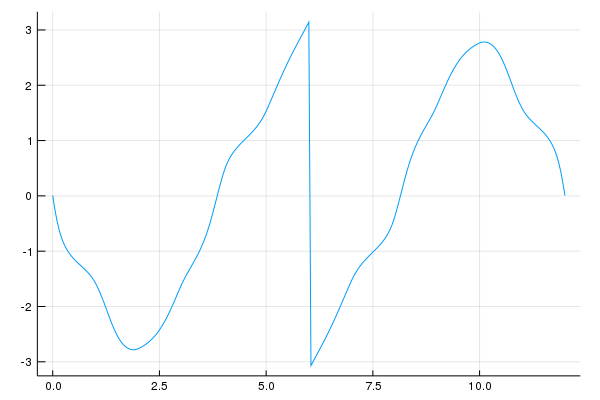
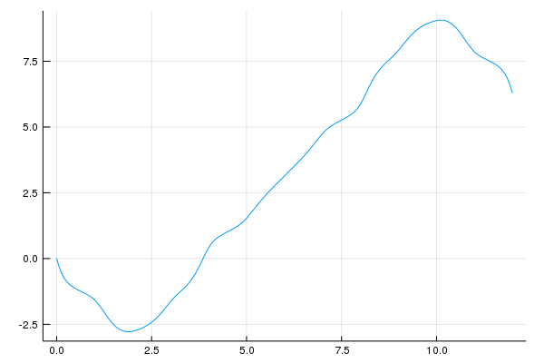

# SimpleTools

[](https://travis-ci.org/scheinerman/SimpleTools.jl)

[](http://codecov.io/github/scheinerman/SimpleTools.jl?branch=master)

Miscellaneous code that is possibly useful for my `SimpleWorld` modules.


## Composition of Dictionaries

Dictionaries are like functions and so it makes sense
to define a composition operation for them.

Suppose that `f` and `g` are dictionaries such
that all the values in `f` appear as keys in `g`.
Then, if `k` is any key of `f` the expression `g[f[k]]`
is defined. In this case, we may compute `g*f` to
yield a new dictionary `h` with the same keys as `f`
and for which `h[k] == g[f[k]]` for all keys `k`.

Warnings are issued under the following circumstances:
+ If some value of `f` is not a key of `g`.
+ If the type of the values in `f` doesn't match
the key type for `g`.

#### Examples

Here is an example without any warnings.

```julia
julia> f = Dict([("alpha", 1), ("bravo", 2)])
Dict{ASCIIString,Int64} with 2 entries:
  "alpha" => 1
  "bravo" => 2

julia> g = Dict([(1,3.14), (2,2.718), (3,1.618)])
Dict{Int64,Float64} with 3 entries:
  2 => 2.718
  3 => 1.618
  1 => 3.14

julia> g*f
Dict{ASCIIString,Float64} with 2 entries:
  "alpha" => 3.14
  "bravo" => 2.718
```

And this is an example in which problems arise
that are not so serious that the composition fails:

```julia
julia> f = Dict([("alpha", 1), ("bravo", 2)])
Dict{ASCIIString,Int64} with 2 entries:
  "alpha" => 1
  "bravo" => 2

julia> g = Dict([(1.0, 3.33)])
Dict{Float64,Float64} with 1 entry:
  1.0 => 3.33

julia> g*f
WARNING: Dictionary type mismatch
WARNING: 1 keys were not mapped
Dict{ASCIIString,Float64} with 1 entry:
  "alpha" => 3.33
```

## Continuity Restored

If one records the angle of a tangent vector as it traverses around a smooth closed
curve, the values should be continuous. However, because there is a 2π ambiguity,
one could see jumps. Here is an example.



If the angles are held in an array named `y` then the following will
correct the problem.
```
julia> make_continuous!(y,2pi)
```
The resulting graph looks like this:




## Flush printing

The `flush_print` function right (or left) justifies its argument in a
`String` of a given number of characters.


+ `flush_print(x,width)` returns a `String` version of `x` right justified
in a string of length `width`.
+ Use `flush_print(x,width,false)` for left-justified.


```
julia> flush_print("hello", 10)
"     hello"

julia> flush_print("hello", 10, false)
"hello     "

julia> flush_print(sqrt(10),30)
"            3.1622776601683795"

julia> flush_print(sqrt(10),8)
┌ Warning: Trunctated to fit width
└ @ IntPrint ~/.julia/dev/IntPrint/src/IntPrint.jl:68
"3.162277"
```
