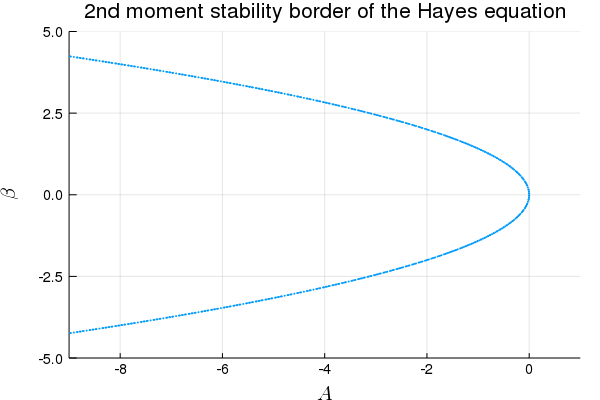
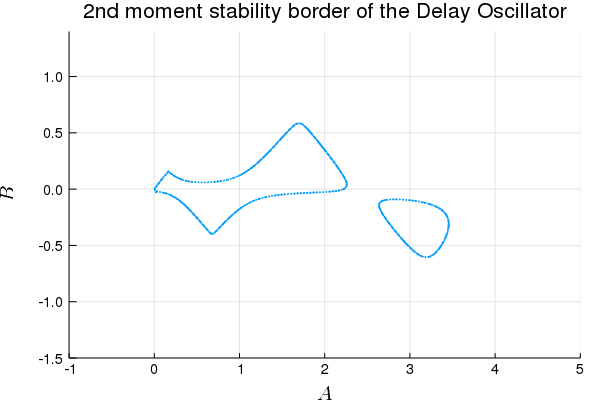

# SemiDiscretizationMethod.jl

Julia package to investigate the behaviour of the first and second moments of stochastic linear delay differential equations based on the paper 
[1] [Stochastic semi‐discretization for linear stochastic delay differential equations](https://onlinelibrary.wiley.com/doi/abs/10.1002/nme.6076) and the book
[2] [Semi-Discretization for Time-Delay Systems (by Insperger and Stepan)](http://link.springer.com/10.1007/978-1-4614-0335-7).

This package provides a tool to approximate the stability properties and stationary behaviour of linear periodic delay systems of the form:

<!-- $$\mathrm{d} \mathbf{x}(t) = \left(\mathbf{A} \mathbf{x}(t) + \sum_{j=1}^g \mathbf{B}_j \mathbf{x}(t-\tau_j)+\mathbf{c}\right)\mathrm{d}t + 
        \sum_{k=1}^w\left(\boldsymbol{\alpha}^k +  \sum_{j=1}^g \boldsymbol{\beta}^k_j \mathbf{x}(t-\tau_j) + \boldsymbol{\sigma}^k \right)\mathrm{d}W^k(t)$$ -->

<!-- $$\mathrm{d} \mathbf{x}(t) = \left(\mathbf{A}(t) \mathbf{x}(t) + \sum_{j=1}^g \mathbf{B}(t) \mathbf{x}(t-\tau_j(t))+\mathbf{c}(t)\right)\mathrm{d}t + 
        \sum_{k=1}^w\left(\boldsymbol{\alpha}^k(t) +  \sum_{j=1}^g \boldsymbol{\beta}^k_j(t) \mathbf{x}(t-\tau_j(t)) + \boldsymbol{\sigma}^k(t) \right)\mathrm{d}W^k(t)$$ -->

by transforming the underlying differential equation into the stochastic mapping:
<!-- $$\mathbf{y}_{n+1} = \left(\mathbf{F}_n+\sum_{k=1}^w\mathbf{G}^k_n\right)\mathbf{y}_n + \left(\mathbf{f}_n + \sum_{k=1}^w\mathbf{g}^k_n\right),$$ -->


where <!-- $n$ -->
<a href="https://www.codecogs.com/eqnedit.php?latex=n" target="_blank"></a>
is the discrete time <!-- ($t_n = n \Delta t$) -->
<a href="https://www.codecogs.com/eqnedit.php?latex=(t_n&space;=&space;n&space;\Delta&space;t)" target="_blank"></a>
, <!-- $\mathbf{F}_n$ -->
<a href="https://www.codecogs.com/eqnedit.php?latex=\mathbf{F}_n" target="_blank"></a>
 is the deterministic mapping matrix constructed using <!-- $\mathbf{A}$ -->
<a href="https://www.codecogs.com/eqnedit.php?latex=\mathbf{A}" target="_blank"></a>
, <!-- $\mathbf{B}$ -->
<a href="https://www.codecogs.com/eqnedit.php?latex=\mathbf{B}" target="_blank"></a>
and <!-- $\tau_j$ -->
<a href="https://www.codecogs.com/eqnedit.php?latex=\tau_j" target="_blank"></a>
, <!-- $\mathbf{G}^k_n$ -->
<a href="https://www.codecogs.com/eqnedit.php?latex=\mathbf{G}^k_n" target="_blank"></a>
are the stochastic mapping matrices constructed using <!-- $\boldsymbol{\alpha}(t)$ -->
<a href="https://www.codecogs.com/eqnedit.php?latex=\boldsymbol{\alpha}" target="_blank"></a>
, <!-- $\boldsymbol{\beta}(t)$ -->
<a href="https://www.codecogs.com/eqnedit.php?latex=\boldsymbol{\beta}" target="_blank"></a>
and <!-- $\tau_j$ -->
<a href="https://www.codecogs.com/eqnedit.php?latex=\tau_j" target="_blank"></a>
, <!-- $\mathbf{f}_n$ --> 
<a href="https://www.codecogs.com/eqnedit.php?latex=\mathbf{f}_n" target="_blank"></a>
and <!-- $\mathbf{g}^k_n$ -->
<a href="https://www.codecogs.com/eqnedit.php?latex=\mathbf{g}^k_n" target="_blank"></a>
are the deterministic and stochastic additive vectors, constructed using <!-- $\mathbf{c}$ -->
<a href="https://www.codecogs.com/eqnedit.php?latex=\mathbf{c}" target="_blank"></a>
and <!-- $\mathbf{\sigma}^k$ -->
<a href="https://www.codecogs.com/eqnedit.php?latex=\boldsymbol{\sigma}^k" target="_blank"></a>
, respectively.
The vector <!-- $\mathbf{y}_n$ -->
<a href="https://www.codecogs.com/eqnedit.php?latex=\mathbf{y}_n" target="_blank"></a>
is the discretized state space vector:

<!-- $$ \mathbf{y}_n = \left(\mathbf{x}(t_n)^\top, \mathbf{x}(t_{n-1})^\top,\ldots,\mathbf{x}(t_{n-r})\right)^\top\!.$$ -->
<a href="https://www.codecogs.com/eqnedit.php?latex=\mathbf{y}_n&space;=&space;\left(\mathbf{x}(t_n)^\top,&space;\mathbf{x}(t_{n-1})^\top,\ldots,\mathbf{x}(t_{n-r})\right)^\top\!." target="_blank"></a>

The first moment dynamics is described by the expected value of the stochastic mapping, leading to a deterministic mapping:
<!-- $$\mathbb{E}\left(\mathbf{y}_{n+1}\right) = \mathbf{F}_n\left(\mathbf{y}_n\right)+\mathbf{f}_n,$$ -->

<a href="https://www.codecogs.com/eqnedit.php?latex=\mathbb{E}\left(\mathbf{y}_{n&plus;1}\right)&space;=&space;\mathbf{F}_n\mathbb{E}\left(\mathbf{y}_n\right)&plus;\mathbf{f}_n," target="_blank"></a>

while the second moment dynamics is described by the expected value of the outer product of the mapping:
<!-- $$\mathbf{M}_n = \mathbb{E}\left(\mathbf{y}_n \mathbf{y}_n^\top\right), 
\quad \Rightarrow \quad \mathbf{m}_n = \mathrm{vec}\left(\mathbf{M}_n\right) :=
\left[ M_{n,11},M_{n,22},\dots ,M_{n,12},M_{n,23},\dots,M_{n,1,\left(r+1\right)d} \right]^\top,$$ -->
<br>

<!-- $$\mathbf{m}_{n+1} =\mathbf{H}_n\,\mathbf{m}_{n}+\mathbf{h}_{1,n}\mathbb{E}\left(\mathbf{y}_n\right)+\mathbf{h}_n,$$ -->


where coefficient matrice
<a href="https://www.codecogs.com/eqnedit.php?latex=$\mathbf{H}_n$" target="_blank"></a>
, 
<a href="https://www.codecogs.com/eqnedit.php?latex=$\mathbf{h}_{1,n}$" target="_blank"></a>
and additive vector 
<a href="https://www.codecogs.com/eqnedit.php?latex=$\mathbf{h}_n$" target="_blank"></a>
are constructed using the mapping matrices 
<a href="https://www.codecogs.com/eqnedit.php?latex=$\mathbf{F}_n$" target="_blank"></a>
,
<a href="https://www.codecogs.com/eqnedit.php?latex=$\mathbf{G}^k_n$" target="_blank"></a>
and vectors
<a href="https://www.codecogs.com/eqnedit.php?latex=$\mathbf{f}_n$" target="_blank"></a>
,
<a href="https://www.codecogs.com/eqnedit.php?latex=$\mathbf{g}^k_n$" target="_blank"></a>
, respectively. Note, that since the coefficient matrices of the original system are constant, the statistical properties of the coefficient matrices and additive vectors, hence the matrices 
<a href="https://www.codecogs.com/eqnedit.php?latex=$\mathbf{F}_n$" target="_blank"></a>
,
<a href="https://www.codecogs.com/eqnedit.php?latex=$\mathbf{H}_n$" target="_blank"></a>
,
<a href="https://www.codecogs.com/eqnedit.php?latex=$\mathbf{h}_{1,n}$" target="_blank"></a>
and vectors
<a href="https://www.codecogs.com/eqnedit.php?latex=\mathbf{f}_n" target="_blank"></a>
,
<a href="https://www.codecogs.com/eqnedit.php?latex=\mathbf{h}_n" target="_blank"></a>
 are also constant.

The integer<!-- $r$ -->
<a href="https://www.codecogs.com/eqnedit.php?latex=r" target="_blank"></a>
is chosen in a way, that <!-- $r\Delta t\geq \max_{t \in \left[0,P\right],j=1\ldots g}\tau_j(t)$ -->
<a href="https://www.codecogs.com/eqnedit.php?latex=\inline&space;r\Delta&space;t\geq&space;\max_{t&space;\in&space;\left[0,P\right],j=1\ldots&space;g}\tau_j(t)" target="_blank"></a>
(the discretized "history function" contains all possible delayed values) and <!-- $d$ -->
<a href="https://www.codecogs.com/eqnedit.php?latex=d" target="_blank"></a>
is the dimension of the state space <!-- $\left(\mathbf{x}(t) \in \mathbb{R}^d\right)$. -->
<a href="https://www.codecogs.com/eqnedit.php?latex=\left(\mathbf{x}(t)&space;\in&space;\mathbb{R}^d\right)" target="_blank"></a>
.

<!-- Each coefficient matrices of delay differential equations are periodic, with a principle period of $P$ -->
<!-- <a href="https://www.codecogs.com/eqnedit.php?latex=P" target="_blank"></a>
, namely: -->
<!-- $A(t)=A(t+P),\; B_j(t)=B_j(t+P),\; \tau_j(t)=\tau_j(t+P)$) and $c(t)=c(t+P)$ -->
<!-- 
Furthermore, the integer $r$ -->
<!-- <a href="https://www.codecogs.com/eqnedit.php?latex=r" target="_blank"></a>
is chosen in a way, that $r\Delta t\geq \max_{t \in \left[0,P\right],j=1\ldots g}\tau_j(t)$ -->
<!-- <a href="https://www.codecogs.com/eqnedit.php?latex=\inline&space;r\Delta&space;t\geq&space;\max_{t&space;\in&space;\left[0,P\right],j=1\ldots&space;g}\tau_j(t)" target="_blank"></a>
 (the discretized "history function" contains all possible delayed values).   -->

With the use of the discrete mappings, the moment stability of the original system can be investigated (approximately), by the spectral radius <!-- $\rho$ -->
<a href="https://www.codecogs.com/eqnedit.php?latex=\rho" target="_blank"></a>
 of the coefficient matrices <!-- $\mathbf{F}_n$ -->
<a href="https://www.codecogs.com/eqnedit.php?latex=\mathbf{F}_n" target="_blank"></a>
 over a period:

<!-- $$\rho\left(\prod_{i=0}^{p-1}\mathbf{F}_{n+i}\right)\left\{
    \begin{matrix}
    <1 & \Rightarrow & \text{the mapping is stable}\\
    >1 & \Rightarrow & \text{the mapping is unstable}
    \end{matrix}
    \right.$$ -->
1&space;&&space;\Rightarrow&space;&&space;\text{the&space;mapping&space;is&space;unstable}&space;\end{matrix}&space;\right.$$" title="$$ \rho\left(\mathbf{F}_{n}\right) / \rho\left(\mathbf{H}_{n}\right) \left\{ \begin{matrix} <1 & \Rightarrow & \text{the mapping is stable}\\ >1 & \Rightarrow & \text{the mapping is unstable} \end{matrix} \right.$$" />

Furthermore, the stationary first and second moments can be determined as the fix points of corresponding moment mappings.
# Citing

If you use this package as part of your research, teaching, or other activities, we would be grateful if you could cite the paper [1] and the book it is based on (BibTeX entries):
```
@article{Sykora2019,
author = {Sykora, Henrik T and Bachrathy, Daniel and Stepan, Gabor},
doi = {10.1002/nme.6076},
journal = {International Journal for Numerical Methods in Engineering},
keywords = { stability, stochastic problems, time delay,differential equations},
number = {ja},
title = {{Stochastic semi-discretization for linear stochastic delay differential equations}},
url = {https://onlinelibrary.wiley.com/doi/abs/10.1002/nme.6076},
volume = {0}
}

@book{Insperger2011,
address = {New York, NY},
author = {Insperger, Tam{\'{a}}s and St{\'{e}}p{\'{a}}n, G{\'{a}}bor},
doi = {10.1007/978-1-4614-0335-7},
isbn = {978-1-4614-0334-0},
publisher = {Springer New York},
series = {Applied Mathematical Sciences},
title = {{Semi-Discretization for Time-Delay Systems}},
url = {http://link.springer.com/10.1007/978-1-4614-0335-7},
volume = {178},
year = {2011}
}
```

# Usage with examples
## Installation
(until it is registered in the Julia ecosystem)
```julia
julia> ] add https://github.com/HTSykora/StochasticSemiDiscretizationMethod.jl
```

## Stochastic Hayes equations
<!-- $$\mathrm{d}{x}(t) = a \,x(t)\mathrm{d}t + \left(\beta \,x(t-1) + 1\right) \mathrm{d}W(t),$$ -->


Here 

<!-- $$ \mathbf{A}(t) \equiv \begin{bmatrix} a \end{bmatrix},
\quad \mathbf{B}_1(t) \equiv \begin{bmatrix}0\end{bmatrix},
\quad \mathbf{c}(t) \equiv \begin{bmatrix} 0 \end{bmatrix},$$ -->
<!-- $$ \boldsymbol{\alpha}^1(t) \equiv \begin{bmatrix} 0 \end{bmatrix},
\quad \boldsymbol{\beta}^1_1(t) \equiv \begin{bmatrix}\beta\end{bmatrix},
\quad \tau^1_1(t) \equiv 1 
\quad \mathrm{and} \quad \boldsymbol{\sigma}^1(t) \equiv \begin{bmatrix} \sigma \end{bmatrix}.$$ -->
." /></a> <br>


(First example in paper [1])

```julia
using StochasticSemiDiscretizationMethod
```

```julia
function createHayesProblem(a,β)
    AMx =  ProportionalMX(a*ones(1,1));
    τ1=1. 
    BMx1 = DelayMX(τ1,zeros(1,1));
    cVec = Additive(1)
    noiseID = 1
    αMx1 = stCoeffMX(noiseID,ProportionalMX(zeros(1,1)))
    βMx11 = stCoeffMX(noiseID,DelayMX(τ1,β*ones(1,1)))
    σ = stAdditive(1,Additive(ones(1)))
    LDDEProblem(AMx,[BMx1],[αMx1],[βMx11],cVec,[σ])
end
```

```julia
hayes_lddep=createHayesProblem(-6.,2.); # LDDE problem for Hayes equation
method=SemiDiscretization(0,0.1) # 0th order semi discretization with Δt=0.1
τmax=1. # the largest τ of the system
# Second Moment mapping
mapping=DiscreteMapping_M2(hayes_lddep,method,τmax,n_steps=10,calculate_additive=true); #The discrete mapping of the system
```

```julia
@show spectralRadiusOfMapping(mapping); # spectral radius ρ of the mapping matrix (ρ>1 unstable, ρ<1 stable)
statM2=VecToCovMx(fixPointOfMapping(mapping), length(mapping.M1_Vs[1])); # stationary second moment matrix of the hayes equation (equilibrium position)
@show statM2[1,1]

# spectralRadiusOfMapping(mapping) = 0.3835887415448961
# statM2[1,1] = 0.12505625506304247
```

### Stability borders of the Hayes Equation
```julia
using MDBM
using Plots
gr();
using LaTeXStrings
```

```julia
method=SemiDiscretization(0,0.1);
τmax=1.

foo(a,b) = log(spectralRadiusOfMapping(DiscreteMapping_M2(createHayesProblem(a,b),method,τmax,
    n_steps=10))); # No additive term calculated

axis=[Axis(-9.0:1.0,:a),
    Axis(-5.0:5.0,:β)]

iteration=4;
stab_border_points=getinterpolatedsolution(solve!(MDBM_Problem(foo,axis),iteration));

scatter(stab_border_points...,xlim=(-9.,1.),ylim=(-5.,5.),
    label="",title="2nd moment stability border of the Hayes equation",xlabel=L"A",ylabel=L"$\beta$",
    guidefontsize=14,tickfont = font(10),markersize=2,markerstrokewidth=0)
```

## Stochastic Linear Delay Oscillator
<!-- $$\dot{x}(t) = v(t)$$
$$\dot{v}(t) + 2\zeta v(t) + A x(t) = B x(t-2\pi) + \left(\alpha x(t) + \beta x(t-2\pi) + \sigma\right)\Gamma(t)$$ -->
<br>


Here 
<!-- $$ \mathbf{x}(t) = \begin{bmatrix} x(t) \\ v(t) \end{bmatrix},
\quad \mathbf{A}(t) \equiv \begin{bmatrix} 0 & 1 \\ -A & -2\zeta \end{bmatrix},
\quad \tau^1_1(t) \equiv 2\pi,
\quad \mathbf{B}_1(t) \equiv \begin{bmatrix}0 & 0\\ B & 0\end{bmatrix},
\quad \mathbf{c}(t) \equiv \begin{bmatrix} 0 \\ 0 \end{bmatrix},$$<br>
$$ \boldsymbol{\alpha}^1(t) \equiv \begin{bmatrix} 0 & 0 \\ \alpha & 0 \end{bmatrix},
\quad \tau^1_1(t) \equiv 2\pi 
\quad \boldsymbol{\beta}^1_1(t) \equiv \begin{bmatrix} 0 & 0 \\ \beta & 0\end{bmatrix},
\quad \mathrm{and} \quad \boldsymbol{\sigma}^1(t) \equiv \begin{bmatrix} 0 \\ \sigma\end{bmatrix}.$$ -->

<br>


(Second example in paper [1])

```julia
function createSLDOProblem(A,B,ζ,α,β,σ)
    AMx =  ProportionalMX(@SMatrix [0. 1.;-A -2ζ]);
    τ1=2π 
    BMx1 = DelayMX(τ1,@SMatrix [0. 0.; B 0.]);
    cVec = Additive(2)
    noiseID = 1
    αMx1 = stCoeffMX(noiseID,ProportionalMX(@SMatrix [0. 0.; α 0.]))
    βMx11 = stCoeffMX(noiseID,DelayMX(τ1,@SMatrix [0. 0.; β 0.]))
    σVec = stAdditive(1,Additive(@SVector [0., σ]))
    LDDEProblem(AMx,[BMx1],[αMx1],[βMx11],cVec,[σVec])
end
```
```julia
SLDOP_lddep=createSLDOProblem(1.,0.1,0.1,0.1,0.1,0.5); # LDDE problem for Hayes equation
method=SemiDiscretization(5,(2π+100eps())/10) # 5th order semi discretization with Δt=2π/10
τmax=2π # the largest τ of the system
# Second Moment mapping
mapping=DiscreteMapping_M2(SLDOP_lddep,method,τmax,n_steps=10,calculate_additive=true); #The discrete mapping of the system

@show spectralRadiusOfMapping(mapping); # spectral radius ρ of the mapping matrix (ρ>1 unstable, ρ<1 stable)
statM2=VecToCovMx(fixPointOfMapping(mapping), length(mapping.M1_Vs[1])); # stationary second moment matrix of the hayes equation (equilibrium position)
@show statM2[1,1] |> sqrt;

# spectralRadiusOfMapping(mapping) = 0.5059591707964441
# statM2[1, 1] |> sqrt = 0.9042071549857947
```
### Stability borders of the Delay Oscillator
```julia
method=SemiDiscretization(5,2π/30);
τmax=2π+100eps()
idxs=[1,2,3:2:StochasticSemiDiscretizationMethod.rOfDelay(τmax,method)*2...]

# ζ=0.05, α=0.3*A, β=0.3*B
foo(A,B) = log(spectralRadiusOfMapping(DiscreteMapping_M2(createSLDOProblem(A,B,0.05,0.3*A,0.3*B,0.),method,τmax,idxs,
    n_steps=30),nev=8)); # No additive term calculated

axis=[Axis(-1.0:0.6:5.0,:A),
    Axis(LinRange(-1.5,1.5,12),:B)]

iteration=4;
stab_border_points=getinterpolatedsolution(solve!(MDBM_Problem(foo,axis),iteration));

scatter(stab_border_points...,xlim=(-1.,5.),ylim=(-1.5,1.4),
    label="",title="2nd moment stability border of the Delay Oscillator",xlabel=L"A",ylabel=L"$B$",
    guidefontsize=14,tickfont = font(10),markersize=2,markerstrokewidth=0)
```

