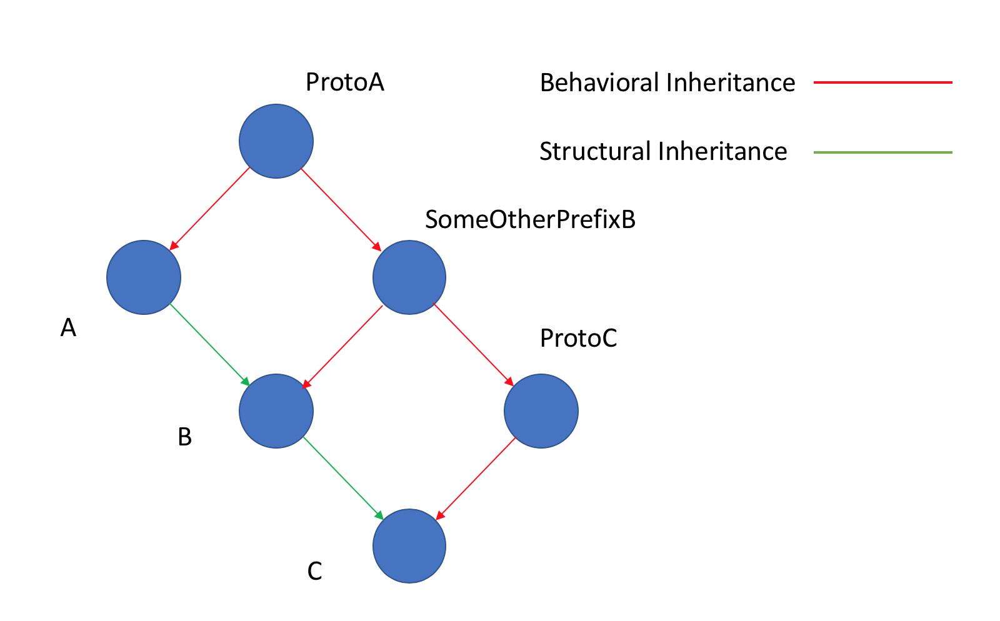

# StructuralInheritance.jl
pseudo structural inheritance for the Julia language

[](https://travis-ci.org/WschW/StructuralInheritance.jl)

[](https://coveralls.io/github/WschW/StructuralInheritance.jl?branch=master)

[](http://codecov.io/github/WschW/StructuralInheritance.jl?branch=master)

## Example
```Julia
julia> using StructuralInheritance

julia> @protostruct struct A{T}
           fieldFromA::T
       end
ProtoA

julia> @protostruct struct B{D} <: A{Complex{D}}
          fieldFromB::D
       end "SomeOtherPrefix"
SomeOtherPrefixB

julia> @protostruct struct C <: B{Int}
         fieldFromC
       end
ProtoC
```

If we take a look at C we can see it inherits structure.

```Julia
julia> @doc C
  No documentation found.

  Summary
  ≡≡≡≡≡≡≡≡≡

  struct C <: ProtoC

  Fields
  ≡≡≡≡≡≡≡≡

  fieldFromA :: Complex{Int64}
  fieldFromB :: Int64
  fieldFromC :: Any

  Supertype Hierarchy
  ≡≡≡≡≡≡≡≡≡≡≡≡≡≡≡≡≡≡≡≡≡

  C <: ProtoC <: SomeOtherPrefixB{Int64} <: ProtoA{Complex{Int64}} <: Any
```
functions can be written to take advantage of the inherited structure

```
julia> getFieldA(x::ProtoA) = x.fieldFromA
getFieldA (generic function with 1 method)

julia> getFieldA(C(3 + im,2,"c's new field"))
3 + 1im
```



## Note: on emulating super constructors
```Julia
julia> using StructuralInheritance

julia> @protostruct struct R
           ff::Int
           sf
           R(x) = new(x,x^2)
           R(x,y) = new(x,y)
       end
ProtoR

julia> @protostruct struct S <: R
           tf::Int
       end
ProtoS
```
We can call the constructor in R and use its values to fill fields in S.
```julia
julia> S(x) = S(StructuralInheritance.totuple(R(x))...,x^3)
S

julia> S(2)
S(2, 4, 8)
```
It is worth noting that this cannot be used with new() as new does not permit
splatting.
