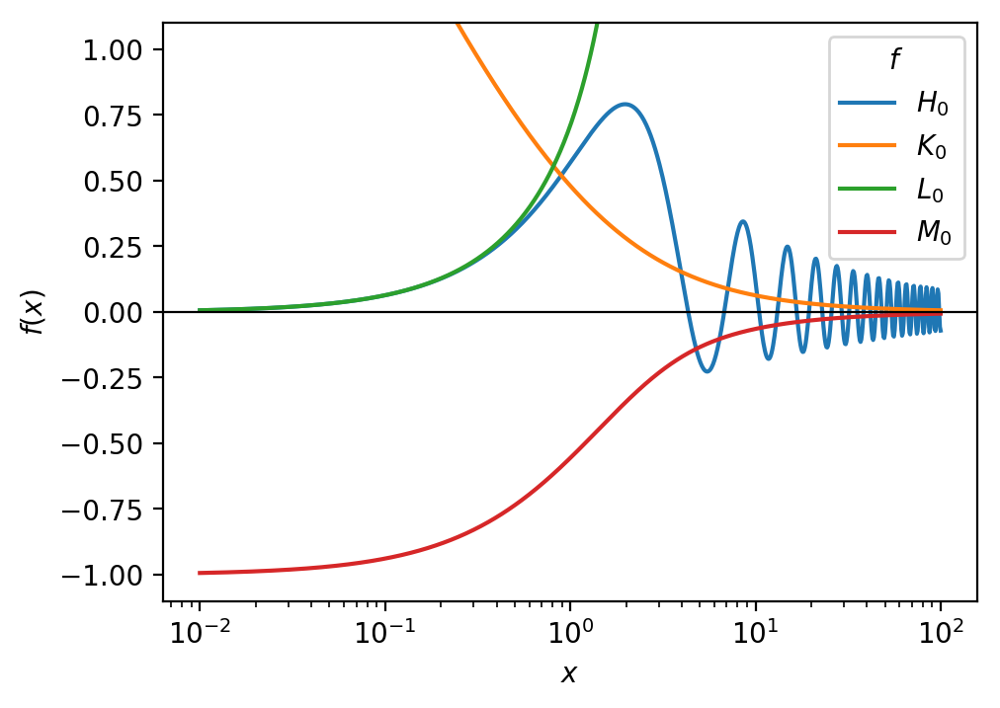

# Struve.jl

This package provides methods to compute the
[Struve functions](https://dlmf.nist.gov/11) H, K, L, and M.

The default methods currently use integral representations of the functions
which are computed numerically using
[QuadGK.jl](https://github.com/JuliaMath/QuadGK.jl) and
[SpecialFunctions.jl](https://github.com/JuliaMath/SpecialFunctions.jl).

It also implements
[fast approximations for H₀ and H₁](http://dx.doi.org/10.1121/1.4968792) on the
real axis (with absolute error below 2×10⁻³).
For fast, high accuracy approximations [ApproxFun.jl](https://github.com/JuliaApproximation/ApproxFun.jl) may be used.

Note that methods are not exported; instead they can be accessed via
dot-syntax, e.g. `Struve.K0(z)`. The currently available methods are:

    Struve.H(ν, z)
    Struve.K(ν, z)
    Struve.L(ν, z)
    Struve.M(ν, z)

    Struve.H0(z)
    Struve.K0(z)
    Struve.L0(z)
    Struve.M0(z)

    Struve.H0_fast(x)
    Struve.H1_fast(x)

Please note: Implementations have not been systematically verified yet; bug
reports and test cases are welcome.
