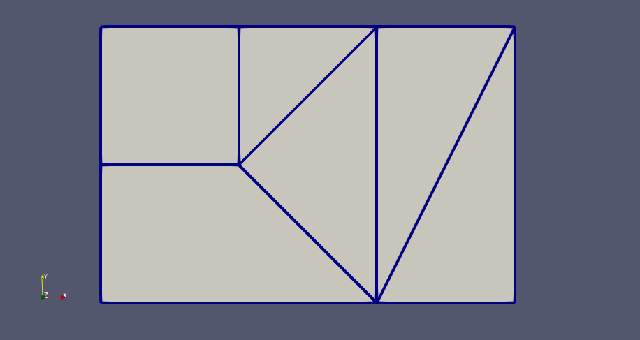

# UnstructuredGrids

*Helper routines for topological operations on unstructured grids in julia*

[](https://travis-ci.com/gridap/UnstructuredGrids.jl)
[](https://codecov.io/gh/gridap/UnstructuredGrids.jl)

If you ❤️ this project, give us a ⭐️!

**UnstructuredGrids** provides a set of functions providing common topological operations associated with unstructured meshes/grids such as:

- Find the lower dimensial objects (e.g., edges and faces) on the boundary of each cell in the grid
- Find the vertices on low dimensional objects of the grid (e.g., the vertices on each face, the vertices on each edge)
- Find dual connections (e.g., cells arround a face, cells around a vertex, faces around an edge, etc.)
- Identify objects on the boundary of the grid
- Export unstructured grids into `.vtu` files (using the `WriteVTK` package).

## Installation

```julia
Pkg.add("UnstructuredGrids")
```
## Quick Start

### Generate a `UGrid` object from its nodal coordinates, cell connectivities, and cell types

```julia
using UnstructuredGrids
using UnstructuredGrids.RefCellGallery: SQUARE, TRIANGLE

# Define coordinates
coords = zeros(2,9)
coords[:,1] = [1,1]
coords[:,2] = [3,1]
coords[:,3] = [4,1]
coords[:,4] = [1,2]
coords[:,5] = [2,2]
coords[:,6] = [1,3]
coords[:,7] = [2,3]
coords[:,8] = [3,3]
coords[:,9] = [4,3]

# Define connectivity
connect = [1,2,5,4,2,3,9,4,5,7,6,5,8,7,5,2,8,2,9,8]
offsets = [1,      5,    8,      12,   15,   18,   21]

# Define cell types
refcells = [SQUARE, TRIANGLE]
types = [1,2,1,2,2,2]

# Generate the UGrid object
grid = UGrid(connect,offsets,types,refcells,coords)

```

### Export the `UGrid` object into vtk format

```julia
writevtk(grid,"foo") # -> generates file "foo.vtu" 
```



### Generate a numbering for the edges (1d-faces) of the grid

```julia
n=1
cell_to_edges = generate_cell_to_faces(n,grid)
@show cell_to_edges.list
@show cell_to_edges.ptrs
# cell_to_edges.list = [1, 2, 3, 4, 5, 6, 7, 3, 8, 9, 10, 11, 12, 8, 2, 13, 11, 7, 14, 13]
# cell_to_edges.ptrs = [1, 5, 8, 12, 15, 18, 21]
```
The vector `cell_to_edges.list` contains the ids of the edges for each cell. The vector `cell_to_edges.ptrs` determines which range of the previous vector correspond to a given cell. E.g., the edge ids on cell number 3 are recovered as follows:
```julia
cell = 3
a = cell_to_edges.ptrs[cell]
b = cell_to_edges.ptrs[cell+1]-1
edges = cell_to_edges.list[a:b]
@show edges
# edges = [3, 8, 9, 10]
```


